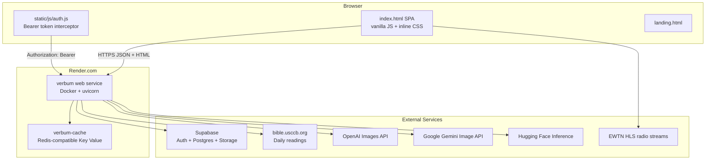
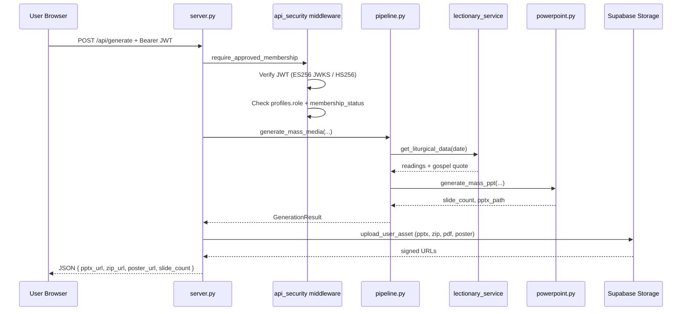
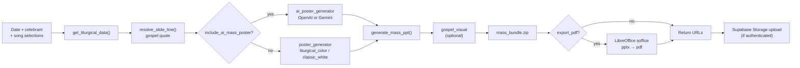
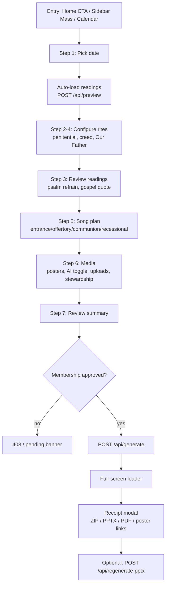
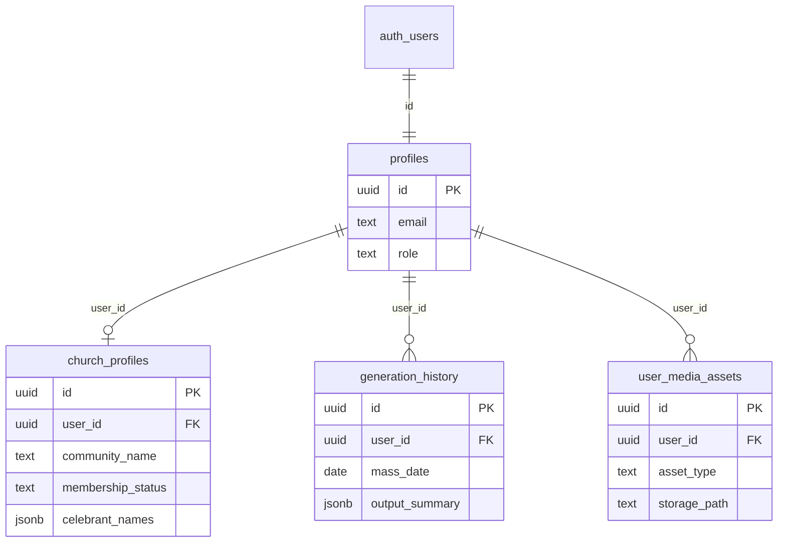
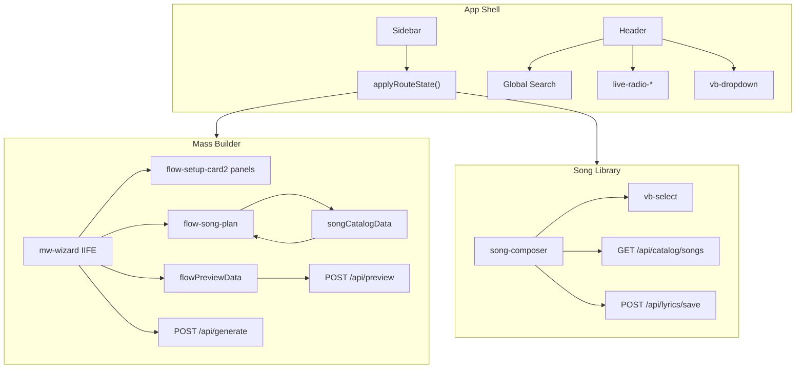
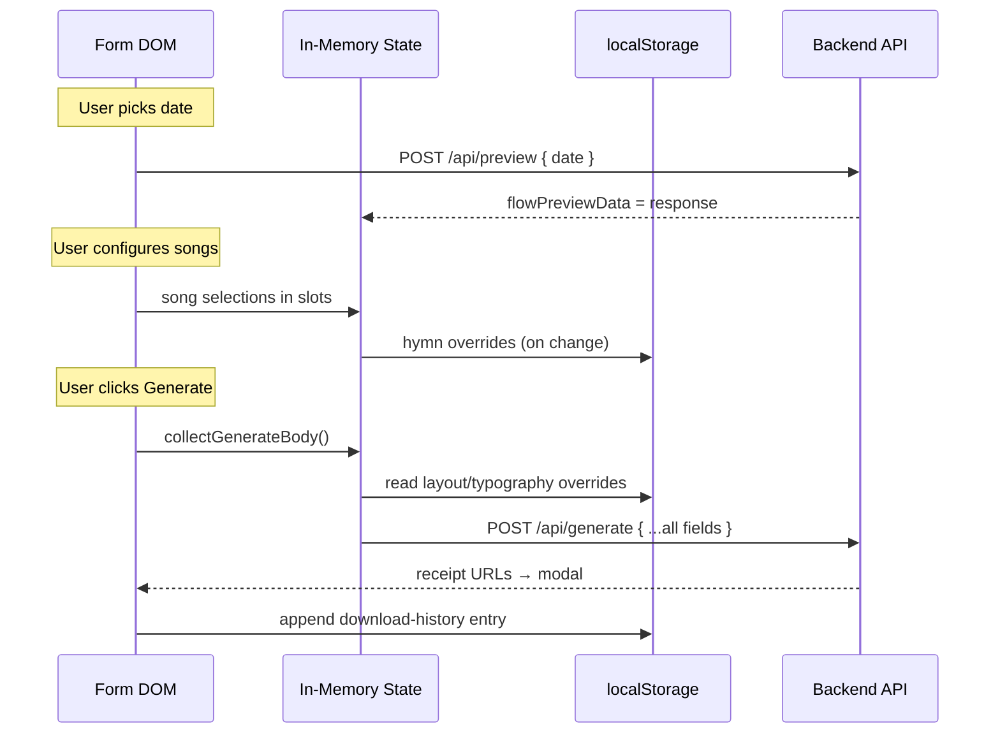
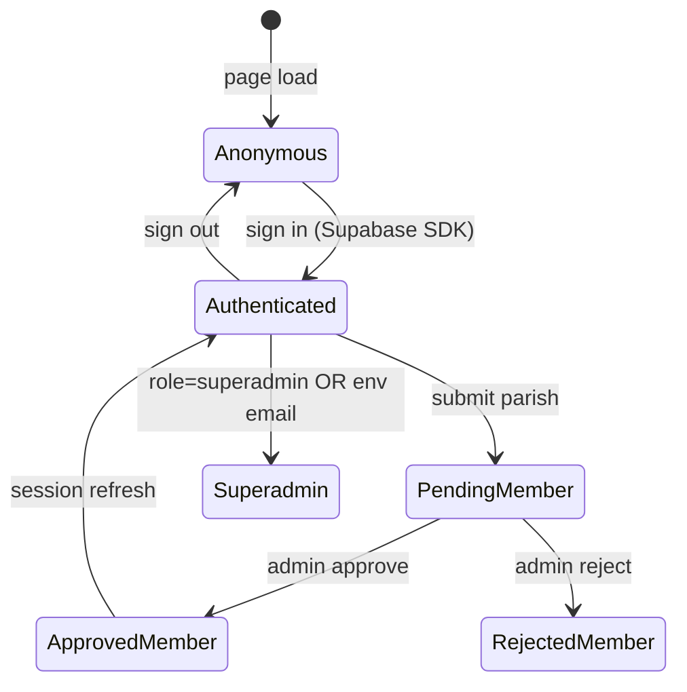

# LiturgyFlow (Verbum) — Complete Technical & Product Documentation

> **Repository:** `github.com/divinogabriel9/verbum`  
> **Product name:** LiturgyFlow  
> **Deploy name:** Verbum  
> **Documentation date:** 2026-07-02  
> **Evidence base:** Full codebase analysis of `server.py` (1,820 lines), `pipeline.py` (831 lines), `templates/index.html` (24,616 lines), 52 `services/` modules, 16 `generator/` modules, 12 Supabase migrations, `render.yaml`, design-system docs, and integration contracts.

---

# SECTION 1 — EXECUTIVE SUMMARY

## What LiturgyFlow Is

LiturgyFlow is a **Catholic Mass media generator** for parishes. A user selects a liturgical date; the app fetches the correct USCCB-aligned readings, recommends hymns by gospel mood and season, and produces ready-to-use media:

- **PowerPoint Mass decks** — full rite-accurate slide order (readings, psalm, gospel acclamation, creed, Our Father, hymns, stewardship) via `python-pptx`, cloned from a master template.
- **Posters & social images** — square / story / OG variants from liturgical-color or classic-white templates, or AI-generated hero art.
- **AI gospel imagery** — sacred art from OpenAI (`gpt-image-2`), Gemini (`gemini-2.5-flash-image`), or Hugging Face (`Tongyi-MAI/Z-Image-Turbo`), with five style presets.
- **Liturgical intelligence** — lectionary Year A/B/C, season colors, hymn library, gospel-mood song recommendations, parish branding.

## Product Snapshot

| Field | Value |
|-------|-------|
| **Product name** | LiturgyFlow |
| **Repo / deploy name** | Verbum (`github.com/divinogabriel9/verbum`) |
| **Primary users** | Parish music directors, liturgy coordinators, priests, superadmins |
| **Core workflow** | Pick date → configure Mass (celebrant, rites, songs, media) → generate ZIP/PPTX/PDF/posters |
| **Backend** | Python 3.13 + FastAPI + uvicorn (`server.py`) |
| **Frontend** | Server-rendered Jinja2 + **single-page app** in `index.html` (~24.6k lines inline CSS/JS) |
| **Auth** | Supabase Auth (JWT ES256/HS256), parish membership approval |
| **Database** | Supabase Postgres (4 public tables + Storage bucket) |
| **Cache / quota** | Redis (Render Key Value) + local SQLite (`lectionary_store`, `image_generation_daily`) |
| **Deploy** | Render Docker web service + Key Value instance (`render.yaml`) |
| **Health check** | `GET /health` |

## Technology Stack

| Layer | Technology |
|-------|------------|
| HTTP server | FastAPI, uvicorn, GZip middleware |
| Templates | Jinja2 (`templates/index.html`, `landing.html`, `auth.html`) |
| PPTX | `python-pptx`, `lxml`, master-template cloning |
| Posters | Pillow, custom `generators/poster/` composer |
| AI images | OpenAI SDK, `google-genai`, `huggingface_hub` |
| Readings | USCCB scraper + SQLite cache + World English Bible fallback |
| Auth | Supabase Auth, PyJWT, JWKS |
| Rate limiting | Redis-backed sliding window (`services/rate_limit.py`) |
| CSS | Inline tokens in `index.html` + `verbum-design-system.css` (2,073 lines) + Tailwind for landing |
| JS | Vanilla inline IIFE in `index.html`; `static/js/auth.js`, `input-limits.js` |

## Maturity Assessment

| Area | Score | Notes |
|------|-------|-------|
| **Liturgical core** | 9/10 | USCCB readings, Year A/B/C, season colors, rite-accurate deck order |
| **PPTX generation** | 8/10 | Master template cloning, hymn typography, 50+ slide types |
| **Hymn library** | 8/10 | JSON catalog, lyrics structuring, gospel-mood recommendations |
| **AI imagery** | 7/10 | Three backends, quota, style presets; placeholder fallback |
| **Auth / membership** | 7/10 | Supabase RLS, approval workflow; trigger/app UPSERT tension |
| **Frontend engineering** | 4/10 | 24k-line monolith, 482 `id` bindings, no code splitting |
| **Operational reliability** | 5/10 | Ephemeral Render filesystem; Supabase storage for uploads |
| **Test coverage** | 3/10 | `test_api.py`, `test_tongyi.py` only |
| **Design consistency** | 7/10 | Strong System A; missing `/radio` page; 5-step vs 7-step wizard |

## Key Strengths

1. **Liturgical trust** — readings from USCCB with SQLite cache; lectionary cycle detection; season-aware colors and hymn recommendations.
2. **Production-grade deck** — `LiturgyFlowTemplate1` master PPTX cloned slide-by-slide; fixed rite order matches GFCC-style Mass flow.
3. **Parish branding** — logo, community name, celebrant/co-celebrant, membership lock, Supabase storage for generated files.
4. **Multi-backend AI** — OpenAI → Gemini → Hugging Face fallback chain with daily quota and style presets.
5. **Single deployable unit** — Docker + Render Blueprint with Redis wired via `fromService`.

## Key Risks

1. **24k-line SPA monolith** — silent breakage when `id`s are renamed; hard to audit.
2. **Ephemeral filesystem** — `outputs/` lost on restart; local download URLs may 404 without Supabase upload.
3. **Missing `/radio` page** — route exists, nav link present, no `<section data-route="/radio">`.
4. **`user_media_assets` table unused** — schema/app drift; no metadata audit trail for uploads.
5. **Pending submissions in JSON** — `data/pending_song_submissions.json` not in Postgres; lost on redeploy.

---

# SECTION 2 — COMPLETE PROJECT STRUCTURE

## Folder Tree (top 3 levels)

```
verbum/
├── server.py                 # FastAPI app entry (~1,820 lines)
├── pipeline.py               # Shared generation orchestration (~831 lines)
├── main.py                   # CLI entry point
├── render.yaml               # Render Blueprint (web + Key Value)
├── Dockerfile                # Python 3.13-slim, uvicorn on $PORT
├── requirements.txt          # Python dependencies
├── package.json              # Tailwind build for landing CSS only
├── readings_cache.json       # Legacy readings cache
│
├── api/
│   └── liturgical_api.py     # Liturgical API helpers
│
├── core/
│   ├── lectionary.py         # Universalis JSON fetch (legacy)
│   └── liturgical_calendar.py # Sunday cycle, season computation
│
├── routes/
│   ├── auth.py               # /api/auth/*, /sign-in, /sign-up
│   └── admin.py              # /api/admin/* (superadmin)
│
├── services/                 # 52 Python modules
│   ├── api_security.py       # JWT, middleware, auth deps
│   ├── supabase_client.py    # Supabase REST client
│   ├── lectionary_service.py # USCCB fetch + SQLite cache
│   ├── hymn_library.py       # Hymn catalog + recommendations
│   ├── song_catalog.py       # API-facing song CRUD
│   ├── gospel_mood.py        # Gospel mood → song matching
│   ├── ai_styles.py          # AI style preset cache
│   ├── image_generation_quota.py # Daily AI image limit
│   ├── rate_limit.py         # Redis/in-memory rate limiting
│   ├── redis_client.py       # Redis connection
│   ├── community_config.py   # Parish name/logo (local JSON)
│   ├── storage_assets.py     # Supabase Storage uploads
│   └── … (40 more)
│
├── generators/
│   ├── powerpoint.py         # Mass deck builder (~4,600 lines)
│   ├── deck_template.py      # Slide geometry constants
│   ├── gfcc_flow_content.py  # Fixed rite text blocks
│   ├── poster_generator.py   # Template posters
│   ├── ai_image_generator.py # OpenAI/Gemini/HF sacred art
│   ├── ai_poster_generator.py # AI primary poster pipeline
│   ├── gospel_visual.py      # Gospel moment PNG
│   └── poster/               # Composable poster primitives
│
├── templates/
│   ├── index.html            # Main SPA (~24,616 lines)
│   ├── landing.html          # Marketing page (398 lines)
│   └── auth.html             # Sign-in/up shell
│
├── static/
│   ├── css/
│   │   ├── verbum-design-system.css  # Canonical component CSS
│   │   ├── verbum-responsive.css
│   │   ├── emil-motion.css           # Motion tokens
│   │   └── landing.css               # Tailwind-built
│   ├── js/
│   │   ├── auth.js           # Fetch interceptor + Supabase session
│   │   ├── auth-page.js      # Auth page logic
│   │   ├── input-limits.js   # Client maxlength from API
│   │   └── hls.min.js        # EWTN radio HLS player
│   ├── brand/                # Logo assets
│   ├── icons/
│   └── images/               # Posters, themes, landing art
│
├── data/
│   ├── hymn_library.json     # Master hymn catalog
│   ├── styles.json           # AI image style fragments
│   ├── community.json        # Default parish config
│   ├── psalm_cache.json      # Cached psalm refrains
│   ├── canticle_cache.json
│   └── pending_song_submissions.json
│
├── supabase/migrations/      # 12 SQL migrations (profiles → storage)
├── docs/design-system/       # 21 design-system markdown files
├── design-system/verbum/     # Token specs + page briefs
├── stitch/                   # Stitch design exports
├── outputs/                  # Ephemeral generated files
├── scripts/                  # Cache builders, preview renderers
└── test_api.py, test_tongyi.py
```

## Major File Reference

| File | Lines | Role |
|------|------:|------|
| `server.py` | 1,820 | FastAPI routes, Pydantic models, middleware registration, file serving |
| `pipeline.py` | 831 | `fetch_preview()`, `generate_mass_media()`, `regenerate_mass_pptx()` |
| `templates/index.html` | 24,616 | Entire in-app SPA: markup, ~11.5k CSS, ~10k JS, routing, Mass Builder wizard |
| `generators/powerpoint.py` | ~4,600 | Slide generation, master template cloning, hymn slides |
| `static/css/verbum-design-system.css` | 2,073 | Canonical component library (buttons, cards, selects, modals) |
| `services/lectionary_service.py` | ~336 | USCCB scrape, SQLite cache, gospel quote extraction |
| `services/hymn_library.py` | large | Hymn JSON load, section candidates, mood tags |
| `REDESIGN_INTEGRATION_CONTRACT.md` | ~434 | DOM `id`/`data-*` wiring contract for redesigns |
| `render.yaml` | 65 | Render Blueprint: `verbum` web + `verbum-cache` Key Value |

---

# SECTION 3 — SYSTEM ARCHITECTURE

## High-Level Architecture



## Request Flow (Authenticated Generate)



## Generation Pipeline



## Middleware Stack

| Order | Middleware | Purpose |
|-------|------------|---------|
| 1 | `SecurityHeadersMiddleware` | CSP, HSTS, X-Frame-Options, COOP |
| 2 | `RateLimitMiddleware` | Redis/in-memory tiered limits |
| 3 | `UserChurchMiddleware` | Load church profile per request |
| 4 | `GZipMiddleware` | Compress responses > 1KB |
| 5 | Auth route guards | JWT on protected prefixes |

## Process Model

- **Single uvicorn worker** per Render instance (free tier).
- **No background job queue** — generation is synchronous HTTP (blocks until PPTX complete).
- **Local caches** — master PPTX template, hymn library JSON, lectionary SQLite, AI style presets (`@lru_cache`, globals).
- **Ephemeral `outputs/`** — files survive only until deploy/restart unless uploaded to Supabase Storage.

---

# SECTION 4 — USER JOURNEY

## Screen Inventory

| # | Route | Page `id` | Purpose | Primary action |
|---|-------|-----------|---------|----------------|
| 1 | `/home` | `home-page` | Dashboard: reflection, readings, events, news | Create event / open Mass Builder |
| 2 | `/mass/builder` | `flow-page` | 7-step Mass wizard (in-place `mw-` chrome) | Generate full Mass package |
| 3 | `/mass/calendar` | `calendar-page` | Liturgical month grid + day detail | Use this date → Builder |
| 4 | `/library/songs` | `lyrics-page` | Song catalog + lyrics composer | Save lyrics |
| 5 | `/library/collections` | `collections-page` | Hub: recent songs, catalog search | Open Library / Builder |
| 6 | `/media/posters` | `posters-page` | Standalone poster generation | Generate poster |
| 7 | `/media/history` | `history-page` | Browser-local download history | Re-download |
| 8 | `/design/theme-lab` | `theme-page` | PPT preview thumbnail grid | Refresh preview |
| 9 | `/design/templates` | `templates-page` | PPTX theme analyzer (superadmin) | Analyze template |
| 10 | `/settings/church` | `settings-page` | Parish profile, logo, celebrants, admin | Save parish |
| 11 | `/settings/app` | `settings-page` | Theme, accent, news toggles, radio, Gemini key | Save preferences |
| 12 | `/radio` | **(missing)** | EWTN radio full page | — (route exists, no page container) |
| — | `/sign-in`, `/sign-up` | `auth.html` | Supabase email/password auth | Sign in / up |
| — | `/` (landing) | `landing.html` | Marketing site | Get started |

## Mass Builder Wizard Steps (7-step `mw-` chrome)

| Step | Label | `data-mw-step` | Content |
|------|-------|----------------|---------|
| 1 | Mass Info | `1` | Date, celebrant picker, co-celebrant |
| 2 | Introductory Rites | `2` | Penitential act, Kyrie, Gloria |
| 3 | Liturgy of the Word | `3` | Readings sidebar, psalm refrain, gospel acclamation/quote |
| 4 | Eucharist | `4` | Creed (Nicene/Apostles'), Our Father language |
| 5 | Music | `5` | Song plan slots, recommendations, hymn layout |
| 6 | Extras | `6` | Stewardship, food sponsors, posters, uploads, AI toggles |
| 7 | Review | `7` | Summary + Generate |

> Legacy 5-step stepper (`data-mass-step-target`: basics, stewardship, readings, media, songs) still exists in markup but is hidden when `body.mw-on` wizard mode is active.

## Core User Flow: Sunday Mass Creation



## Auth / Membership Journey

| State | UI signal | Generation access |
|-------|-----------|-------------------|
| Anonymous (auth off) | No banner | Allowed |
| Anonymous (auth on) | Sign-in prompt | Blocked on generate |
| Draft parish | "Submit your parish" banner | Blocked |
| Pending | "Membership pending" banner | 403 on generate |
| Approved member | No banner / approved badge | Full access |
| Rejected | "Not approved" banner | 403 on generate |
| Superadmin | Admin panels in Settings | Bypass membership; admin APIs |

## Route Aliases (Legacy Redirects)

| Old path | New path |
|----------|----------|
| `/lyrics-dashboard` | `/library/songs` |
| `/theme-dashboard` | `/design/theme-lab` |
| `/mass-flow-dashboard` | `/mass/builder` |
| `/media/presentation` | `/mass/builder` |
| `/` | `/home` |

---

# SECTION 5 — FEATURE INVENTORY

## Liturgical & Readings

| Feature | Implementation | API / Module |
|---------|----------------|--------------|
| Daily readings fetch | USCCB scrape + SQLite cache | `GET /api/readings/{date}`, `lectionary_service.py` |
| Liturgical calendar month | Season colors, solemnities | `GET /api/calendar/month` |
| Gospel slide quote extraction | Sentence splitting + interactive pick | `gospel_quote_extractor.py` |
| Psalm refrain options | Multiple refrains per psalm | `usccb_readings.collect_psalm_refrain_options()` |
| Lectionary Year A/B/C | Sunday cycle from date | `core/liturgical_calendar.py` |
| Liturgical season colors | Green/purple/white/red/rose | `services/liturgical_calendar.py` |
| Readings preview (fast) | Skip hymn discovery | `POST /api/preview` with `readings_only: true` |
| Gospel image (cached) | Pre-rendered or gradient | `GET /api/gospel-image/{date}` |

## Mass Generation

| Feature | Implementation | API / Module |
|---------|----------------|--------------|
| Full Mass PPTX | Master template clone + dynamic slides | `POST /api/generate` → `powerpoint.py` |
| PPTX-only regenerate | Typography/lyric overrides without full regen | `POST /api/regenerate-pptx` |
| PDF export | LibreOffice `soffice` conversion | `export_pdf: true` on generate |
| ZIP bundle | All outputs in `mass_bundle.zip` | `_write_mass_bundle_zip()` |
| Penitential act slides | Fixed GFCC text | `PENITENTIAL_ACT` template |
| Kyrie / Gloria | Cloned from authored `.pptx` templates | `_kyrie_template`, `_gloria_template` |
| Creed choice | Nicene OR Apostles' (never both) | `creed_choice: nicene \| apostles` |
| Our Father languages | English, Malay, Tagalog, Visaya, Korean | `our_father_choice` |
| LOTW/LOTE divider posters | 4 designs each (`lotw1-4`, `lote1-4`) | Bundled PNGs in `static/images/posters/` |
| Mass collection slide | Currency PHP/KRW/MYR + amount + date | `mass_collection_*` fields |
| Food sponsors slide | Uppercase name list | `food_sponsors[]` |
| Announcement image slides | Full-bleed uploaded PNGs | `announcement_basenames[]` |
| Custom divider upload | User PNG between rite sections | `POST /api/upload/mass-divider` |
| Branding toggles | Logo, parish name, footer tag | `include_church_logo/name/footer` |
| Hymn layout | Single (1 block/slide) or dual (2 blocks) | `hymn_lyrics_layout` |
| Per-song layout override | `{ entrance: { song_id: 'dual' } }` | `hymn_layout_overrides` |
| Lyric text overrides | Per-section per-song custom lyrics | `hymn_lyric_overrides` |
| Hymn typography | Per-section font sizes | `hymn_typography` dict |

## Posters & Media

| Feature | Implementation | API / Module |
|---------|----------------|--------------|
| Liturgical-color poster | Season hex background + typography | `poster_generator.generate_mass_poster()` |
| Classic white poster | White background variant | `poster_template: classic_white` |
| AI primary poster | OpenAI or Gemini hero art | `include_ai_mass_poster: true` |
| AI style presets | cinematic, realistic, renaissance, stained_glass, modern | `data/styles.json` |
| Social exports | Instagram square/story, OG, 16:9 | `include_social_exports: true` |
| Gospel moment PNG | Scene illustration for deck | `include_gospel_art: true` |
| Saved poster gallery | Upload/list/delete user posters | `/api/saved-posters`, `/api/upload/saved-poster` |
| Poster existence check | Skip regen if file exists | `GET /api/poster-exists` |
| Standalone poster page | `/media/posters` UI | Same generate pipeline |

## Hymn Library & Songs

| Feature | Implementation | API / Module |
|---------|----------------|--------------|
| Song catalog (lite) | Titles + metadata, no full lyrics | `GET /api/catalog/songs?lite=1` |
| Song detail + lyrics | Per section/id | `GET /api/catalog/songs/{section}/{id}` |
| Save structured lyrics | Verse/chorus/bridge/response blocks | `POST /api/lyrics/save` |
| Gospel-mood recommendations | triumphant, solemn, mercy, journey, reverent | `gospel_mood.py`, `song_recommendations.py` |
| Live section refresh | Web hymn discovery + shuffle | `POST /api/songs/refresh` |
| Refresh all sections | Parallel refresh | `POST /api/songs/refresh-all` |
| Import songs (admin) | Bulk title import | `POST /api/songs/import`, `/import-list` |
| Fetch lyrics from web | Auto-fetch for selection | `POST /api/songs/fetch-lyrics` |
| Catalog CRUD (admin) | PATCH/DELETE songs | `/api/catalog/songs/{section}/{id}` |
| Pending song submissions | JSON file queue | `POST /api/submissions/priest` (priest names) |
| Web hymn discovery | Season + gospel keyword search | `web_hymn_discovery.py` |

## AI & Quota

| Feature | Implementation | API / Module |
|---------|----------------|--------------|
| OpenAI sacred art | `gpt-image-2` default | `ai_image_generator._generate_with_openai()` |
| Gemini sacred art | `gemini-2.5-flash-image` + fallbacks | `ai_image_generator._generate_with_gemini()` |
| Hugging Face fallback | `Tongyi-MAI/Z-Image-Turbo` | `HUGGINGFACE_API_TOKEN` |
| Auto backend chain | OpenAI → Gemini → HF → gradient placeholder | `image_backend: auto` |
| Daily image quota | Redis + SQLite fallback | `GET /api/image-quota`, `IMAGE_GENERATION_DAILY_LIMIT` |
| Quota enforcement | Pre-check on generate + `/generate-image` | `reserve_daily_image_generation()` |
| Reuse cached hero | Skip API call for same date+style | `reuse_existing_poster: true` |
| Standalone image gen | `POST /generate-image` | Direct sacred illustration endpoint |
| Gemini key (admin) | Save to `.env.gemini` | `POST /api/settings/gemini-api-key` |

## Auth, Membership & Admin

| Feature | Implementation | API / Module |
|---------|----------------|--------------|
| Supabase email auth | JWT sessions | `/sign-in`, `/sign-up`, `auth.js` |
| Parish profile | Name, logo, celebrants JSON | `/api/community`, `church_profiles` table |
| Membership approval | draft → pending → approved/rejected | Admin `/api/admin/memberships/*` |
| Parish name lock | Trigger prevents rename after lock | `church_profiles_lock_parish_name` |
| Logo lock | Superadmin-only logo changes | `can_edit_logo()` |
| Superadmin bootstrap | `SUPERADMIN_EMAILS` env on startup | `membership_config.py` |
| Pending priest submissions | Approve/reject | `/api/admin/submissions/priests/*` |
| Pending song submissions | Approve/reject | `/api/admin/submissions/songs/*` |
| PPTX theme analyzer | Extract colors/fonts from upload | `POST /api/design/analyze-template` |

## Home & Content Feeds

| Feature | Implementation | API / Module |
|---------|----------------|--------------|
| Catholic news headlines | Vatican + CNA RSS | `GET /api/catholic-news` |
| WYD news | World Youth Day feed | `GET /api/wyd-news` |
| EWTN radio streams | HLS player in header pill | `GET /api/ewtn/radio`, `hls.min.js` |
| Home events board | Local-only event cards | `localStorage` (no server persistence) |
| Reflection hero | Gospel image + verse | `/api/gospel-image/{date}` |
| Membership banner | State-driven CTA | `/api/auth/me` |

## Settings & Preferences

| Feature | Implementation | Storage |
|---------|----------------|---------|
| Light/dark/system theme | `data-theme` on `<html>` | `localStorage: verbum-theme-preference` |
| OLED dark variant | `data-dark-variant=oled` | `localStorage: verbum-toggle-dark` |
| Visual style presets | Apple/Notion/Linear-inspired | `localStorage: verbum-visual-style` |
| Custom accent color | CSS `--accent` override | `localStorage: verbum-accent-color` |
| Nav tab visibility | Show/hide sidebar tabs | `localStorage: verbum-nav-tabs-enabled` |
| News feed toggles | Vatican/CNA on/off | `localStorage: verbum-home-news-*` |
| Radio station preference | EWTN region id | `localStorage: verbum-ewtn-radio` |
| Collection currency | PHP/KRW/MYR default | `localStorage: verbum-collection-currency` |
| Hymn layout default | single/dual | `localStorage: verbum-hymn-layout` |

---

# SECTION 6 — DATABASE

## Postgres Tables (Supabase `public` schema)

### `profiles`

| Column | Type | Notes |
|--------|------|-------|
| `id` | `uuid` PK | FK → `auth.users(id)` ON DELETE CASCADE |
| `email` | `text` | Synced from auth signup |
| `first_name` | `text` | From `raw_user_meta_data` |
| `last_name` | `text` | |
| `avatar_url` | `text` | |
| `role` | `text` | `'member'` \| `'superadmin'` (CHECK constraint) |
| `created_at` | `timestamptz` | |
| `updated_at` | `timestamptz` | Auto via trigger |

**RLS:** `profiles_select_own`, `profiles_update_own` — authenticated users read/update own row only.  
**Trigger:** `on_auth_user_created` → `handle_new_user()` auto-inserts profile on signup.  
**Guard:** `profiles_guard_role` trigger blocks client JWT from escalating to superadmin.

### `church_profiles`

| Column | Type | Notes |
|--------|------|-------|
| `id` | `uuid` PK | |
| `user_id` | `uuid` FK | UNIQUE → `profiles(id)` |
| `community_name` | `text` | Parish name (lockable) |
| `logo_path` | `text` | Storage path or local path |
| `celebrant_names` | `jsonb` | Array of celebrant strings |
| `membership_status` | `text` | `draft` \| `pending` \| `approved` \| `rejected` |
| `community_name_locked_at` | `timestamptz` | Set on approval; blocks rename |
| `created_at` / `updated_at` | `timestamptz` | |

**RLS:** Own-row SELECT/INSERT/UPDATE/DELETE for authenticated. DELETE policy dropped in migration 011.  
**Triggers:** `church_profiles_lock_parish_name`, `church_profiles_guard_membership_and_locks`.

### `generation_history`

| Column | Type | Notes |
|--------|------|-------|
| `id` | `uuid` PK | |
| `user_id` | `uuid` FK | → `profiles(id)` |
| `mass_date` | `date` | |
| `celebrant` | `text` | |
| `output_summary` | `jsonb` | `{ title, slide_count, export_stem }` |
| `created_at` | `timestamptz` | |

**RLS:** Own-row SELECT/INSERT/DELETE.  
**Usage:** Written on successful generate via `record_generation()`; **no UI reads it yet**.

### `user_media_assets`

| Column | Type | Notes |
|--------|------|-------|
| `id` | `uuid` PK | |
| `user_id` | `uuid` FK | |
| `asset_type` | `text` | `logo` \| `poster` \| `divider` \| `announcement` |
| `storage_path` | `text` | Supabase Storage key |
| `original_name` | `text` | |
| `byte_size` | `integer` | |
| `created_at` | `timestamptz` | |

**RLS:** Own-row CRUD.  
**Status:** **Table exists but app does not INSERT** — uploads go directly to Storage without metadata rows.

## Storage Bucket: `user-uploads`

| Property | Value |
|----------|-------|
| Public | `false` |
| Max file size | 50 MB (migration 012) |
| Allowed MIME | `image/png`, `image/jpeg`, `image/webp`, `image/gif`, PPTX, ZIP |
| Path convention | `{auth.uid()}/generated/{stem}/{filename}` |
| RLS | Folder prefix must equal `auth.uid()` |

## Local SQLite Databases

| File | Table(s) | Purpose |
|------|----------|---------|
| `data/lectionary.sqlite` (via `lectionary_store.db_path`) | readings cache | USCCB payload per date |
| `data/app.sqlite` | `image_generation_daily` | AI quota fallback when Redis unavailable |

## ER Diagram



## Data Interaction Map

| Operation | Table / Store | Writer | Reader |
|-----------|---------------|--------|--------|
| Sign up | `profiles` | `handle_new_user()` trigger | `/api/auth/me` |
| Submit parish | `church_profiles` | `POST /api/community/submit-parish` | `GET /api/community` |
| Approve membership | `church_profiles.membership_status` | Admin API (service role) | Membership banner, generate gate |
| Generate Mass | `generation_history` | `record_generation()` | *(none — no history UI)* |
| Upload logo | Storage `user-uploads` | `POST /api/upload-logo` | Church profile, PPTX branding |
| Upload generated PPTX | Storage `user-uploads` | `upload_user_asset()` post-generate | Signed URL in response |
| Cache readings | SQLite `lectionary_store` | `upsert()` on USCCB fetch | `get_liturgical_data()` |
| AI quota | Redis / SQLite | `reserve_daily_image_generation()` | `GET /api/image-quota` |
| Hymn catalog | `data/hymn_library.json` | Admin import, lyrics save | Catalog API, generation |
| Pending submissions | `data/pending_song_submissions.json` | User submit | Admin approve/reject |
| Parish config (fallback) | `data/community.json` | `update_community()` | Local dev / anonymous mode |

---

# SECTION 7 — API DOCUMENTATION

## Health & Config

| Method | Path | Auth | Description |
|--------|------|------|-------------|
| `GET` | `/health` | None | `{ "status": "ok" }` |
| `GET` | `/api/input-limits` | None | Maxlength limits for all form fields |
| `GET` | `/api/auth/config` | None | Supabase URL + publishable key for browser SDK |
| `GET` | `/api/auth/me` | Optional JWT | Profile + church + membership payload |

## Pages (HTML, all render `index.html` or dedicated template)

| Method | Path | Template |
|--------|------|----------|
| `GET` | `/` | `index.html` (redirects to `/home` client-side) |
| `GET` | `/home` | `index.html` |
| `GET` | `/mass/builder` | `index.html` |
| `GET` | `/mass/calendar` | `index.html` |
| `GET` | `/library/songs` | `index.html` |
| `GET` | `/library/collections` | `index.html` |
| `GET` | `/media/posters` | `index.html` |
| `GET` | `/media/history` | `index.html` |
| `GET` | `/design/theme-lab` | `index.html` |
| `GET` | `/design/templates` | `index.html` |
| `GET` | `/settings/church` | `index.html` |
| `GET` | `/settings/app` | `index.html` |
| `GET` | `/radio` | `index.html` (no page section — renders empty) |
| `GET` | `/sign-in` | `auth.html` |
| `GET` | `/sign-up` | `auth.html` |

## Readings & Calendar

| Method | Path | Auth | Request | Response |
|--------|------|------|---------|----------|
| `GET` | `/api/readings/{date}` | Session when auth on | `date`: `YYYY-MM-DD` | Readings payload (gospel, psalm, seasons, refrains) |
| `POST` | `/api/preview` | None | `{ date, readings_only? }` | `PreviewPayload` JSON (songs, sentences, slide estimate) |
| `GET` | `/api/calendar/month` | None | `?year=&month=` | Month grid with liturgical colors per day |
| `GET` | `/api/gospel-image/{date}` | None | | PNG or redirect to cached image |

## Generation

| Method | Path | Auth | Description |
|--------|------|------|-------------|
| `POST` | `/api/generate` | Approved member | Full Mass package (PPTX, poster, ZIP, optional PDF) |
| `POST` | `/api/regenerate-pptx` | Approved member | Rebuild PPTX only with current typography/lyrics |
| `POST` | `/generate-image` | Approved member | Standalone sacred illustration |
| `GET` | `/api/poster-exists` | Session when auth on | `?date=&style=` — check cached AI poster |
| `GET` | `/api/image-quota` | Optional | `{ limit, used, remaining, allowed }` |
| `POST` | `/api/ppt-preview/refresh` | Session when auth on | Render PPT preview PNGs for Theme Lab |

### `POST /api/generate` — Key Request Fields (`GenerateBody`)

| Field | Type | Default | Description |
|-------|------|---------|-------------|
| `date` | string | required | `YYYY-MM-DD` |
| `celebrant` | string | required | Main celebrant name |
| `co_celebrant` | string | `""` | Optional co-celebrant |
| `sentence_index` | int? | null | Gospel quote sentence picker |
| `gospel_quote_override` | string? | null | Manual gospel line for slides |
| `poster_template` | string | `liturgical_color` | `liturgical_color` \| `classic_white` |
| `include_ai_mass_poster` | bool | false | Use AI for primary poster |
| `ai_poster_backend` | string | `openai` | `openai` \| `gemini` |
| `ai_poster_style` | string | `cinematic` | Style preset key |
| `include_social_exports` | bool | false | Instagram/OG variants |
| `export_pdf` | bool | false | LibreOffice PDF export |
| `include_gospel_art` | bool | true | Gospel moment PNG |
| `songs` | object? | null | `{ entrance, offertory, communion_1, communion_2, recessional, meditation }` |
| `creed_choice` | string | `nicene` | `nicene` \| `apostles` |
| `our_father_choice` | string | `english` | `english` \| `malay` \| `tagalog` \| `visaya` \| `korean` |
| `hymn_lyrics_layout` | string | `single` | `single` \| `dual` |
| `lotw_poster` / `lote_poster` | string | `lotw1`/`lote1` | Divider poster design id |
| `mass_collection_*` | strings | | Amount, currency, date label |
| `food_sponsors` | string[] | `[]` | Sponsor names |
| `announcement_basenames` | string[] | `[]` | Uploaded announcement images |
| `divider_poster_basename` | string? | null | Custom divider PNG |
| `include_church_logo/name/footer` | bool | false/true | Branding toggles |
| `hymn_lyric_overrides` | dict? | null | Per-section lyric overrides |
| `hymn_layout_overrides` | dict? | null | Per-song layout overrides |
| `hymn_typography` | dict? | null | Per-section typography |
| `psalm_text_override` / `psalm_refrain_index` / `psalm_response_override` | | | Psalm customization |

### `POST /api/generate` — Response Fields

| Field | Type | Description |
|-------|------|-------------|
| `ok` | bool | Success flag |
| `title` | string | Mass celebration title |
| `gospel_reference` | string | Citation |
| `gospel_quote` | string | Selected slide line |
| `slide_count` | int | Total slides in deck |
| `export_stem` | string | Filename stem |
| `pptx_url` | string? | Download URL (local or Supabase signed) |
| `pdf_url` | string? | PDF if `export_pdf` and LibreOffice available |
| `poster_url` | string? | Primary poster PNG |
| `poster_ppt_url` | string? | Poster as PPTX |
| `zip_url` | string? | Full bundle ZIP |
| `ai_poster_urls` | object? | Social variant URLs |
| `liturgical_color` | object? | `{ color_name, hex, season, rgb }` |
| `selected_songs` | object? | Resolved song titles per section |

## Community & Settings

| Method | Path | Auth | Description |
|--------|------|------|-------------|
| `GET` | `/api/community` | Session when auth on | Parish profile + celebrants |
| `POST` | `/api/community` | Approved member | Update community name |
| `POST` | `/api/community/submit-parish` | Session | Submit parish for approval |
| `POST` | `/api/community/profile` | Approved member | Update profile fields |
| `GET` | `/api/settings/gemini-api-key` | Superadmin | Masked key hint (last 4 chars) |
| `POST` | `/api/settings/gemini-api-key` | Superadmin | Save Gemini key to `.env.gemini` |

## Uploads & Files

| Method | Path | Auth | Description |
|--------|------|------|-------------|
| `POST` | `/api/upload-logo` | Approved member | Parish logo (max 2.5 MB) |
| `POST` | `/api/upload/mass-divider` | Approved member | Custom divider image |
| `POST` | `/api/upload/announcement-slide` | Approved member | Announcement slide image |
| `POST` | `/api/upload/saved-poster` | Approved member | Save poster to gallery |
| `GET` | `/api/saved-posters` | Approved member | List saved poster basenames |
| `DELETE` | `/api/saved-posters/{basename}` | Approved member | Delete saved poster |
| `GET` | `/api/files/media/{path}` | Session when auth on | Serve generated media |
| `GET` | `/api/files/uploads/{path}` | Session when auth on | Serve user uploads |
| `GET` | `/api/files/preview/{filename}` | Session when auth on | PPT preview PNG |

## Song Catalog

| Method | Path | Auth | Description |
|--------|------|------|-------------|
| `GET` | `/api/catalog/songs` | Session when auth on | Full or `?lite=1` catalog |
| `GET` | `/api/catalog/songs/{section}/{id}` | Session when auth on | Song detail + lyrics |
| `PATCH` | `/api/catalog/songs/{section}/{id}` | Superadmin | Update song metadata |
| `DELETE` | `/api/catalog/songs/{section}/{id}` | Superadmin | Delete song |
| `POST` | `/api/lyrics/save` | Approved member | Save structured lyrics |
| `POST` | `/api/songs/refresh` | Approved member | Refresh one section's recommendations |
| `POST` | `/api/songs/refresh-all` | Approved member | Refresh all sections |
| `POST` | `/api/songs/import` | Superadmin | Import song rows |
| `POST` | `/api/songs/import-list` | Superadmin | Import title list |
| `POST` | `/api/songs/fetch-lyrics` | Approved member | Fetch lyrics for a song |
| `POST` | `/api/submissions/priest` | Session | Submit priest name for approval |

## Admin

| Method | Path | Auth | Description |
|--------|------|------|-------------|
| `GET` | `/api/admin/memberships/pending` | Superadmin | Pending parish memberships |
| `POST` | `/api/admin/memberships/{user_id}/approve` | Superadmin | Approve membership |
| `POST` | `/api/admin/memberships/{user_id}/reject` | Superadmin | Reject membership |
| `GET` | `/api/admin/submissions/songs/pending` | Superadmin | Pending song submissions |
| `POST` | `/api/admin/submissions/songs/{id}/approve` | Superadmin | Approve song |
| `POST` | `/api/admin/submissions/songs/{id}/reject` | Superadmin | Reject song |
| `GET` | `/api/admin/submissions/priests/pending` | Superadmin | Pending priest names |
| `POST` | `/api/admin/submissions/priests/{id}/approve` | Superadmin | Approve priest |
| `POST` | `/api/admin/submissions/priests/{id}/reject` | Superadmin | Reject priest |
| `POST` | `/api/design/analyze-template` | Superadmin | Analyze uploaded PPTX theme |

## Content Feeds

| Method | Path | Auth | Description |
|--------|------|------|-------------|
| `GET` | `/api/catholic-news` | None | Vatican + CNA headlines |
| `GET` | `/api/wyd-news` | None | WYD news items |
| `GET` | `/api/ewtn/radio` | None | Radio station catalog with HLS URLs |

## Rate Limit Tiers (when `RATE_LIMIT_ENABLED=1`)

| Tier | Default | Routes |
|------|---------|--------|
| auth | 30/min | `/api/auth`, `/sign-in`, `/sign-up` |
| expensive | 20/min | generate, upload, regenerate, generate-image |
| api | 120/min | `/api/*` |
| default | 300/min | pages, static |

---

# SECTION 8 — COMPONENT ARCHITECTURE

## Architecture Model

The frontend is **not a component framework**. It is a **CSS-class + DOM-id SPA**:

- **Markup:** `templates/index.html` — all screens as `<section class="page" data-route="…">`.
- **Binding:** `const $ = (id) => document.getElementById(id)` — 482 unique `id` attributes.
- **Guards:** Most lookups wrapped in `if (el)` — missing `id` → **silent feature loss**.
- **Events:** Mix of direct `addEventListener` on known ids and `data-action` delegation (lyrics blocks).
- **Styles:** System A tokens in inline `:root` + `verbum-design-system.css`; wizard uses `mw-` prefixed classes.

## App Shell Components

| Component | CSS / IDs | Location | Role |
|-----------|-----------|----------|------|
| Sidebar | `.app-sidebar`, `data-nav-tab` links | Persistent left nav | Primary navigation |
| Bottom nav | `.app-bottom-nav` | Mobile | 4-tab + More sheet |
| Header | `#topbar-title`, `#liturgical-indicator` | Top bar | Brand, season, radio pill |
| Global search | `#app-global-search`, `.global-search-*` | Header | ⌘K command palette (partial) |
| Create menu | `.btn-create`, `data-create` | Header | + Create dropdown |
| Account menu | `#account-menu`, `.vb-dropdown-*` | Header | Settings, sign out |
| Toast stack | `#toast-stack`, `.toast` | Global overlay | Success/error toasts |
| Membership banner | `#home-membership-banner` | Home | Auth state CTA |
| Radio pill | `.live-radio-*` | Header | Mini EWTN player |

## Page-Level Component Groups

### Home (`#home-page`)

| Component | Key IDs | Notes |
|-----------|---------|-------|
| Reflection hero | `home-reflection-*` | Background image + verse |
| Mass CTA cards | `home-mass-cta`, `home-mass-snippet-*` | Links to Builder |
| Reading tiles | `home-reading-*` | 3 expandable reading cards |
| Events board | `home-events-list`, `home-events-empty` | Local-only events |
| News feed | `home-news-*`, `btn-home-news-refresh` | Collapsible, Vatican/CNA |
| Event modal | `home-event-modal-*` | Create local event |

### Mass Builder (`#flow-page`)

| Component | Key IDs / Classes | Notes |
|-----------|-------------------|-------|
| Wizard chrome | `#mw-wizard`, `#mw-progress`, `data-mw-step` | 7-step paginated wizard |
| Legacy stepper | `#mass-builder-stepper`, `data-mass-step-target` | 5-step (hidden in wizard mode) |
| Inner tabs | `data-flow-tab`, `data-flow-panel` | Setup / Songs panels |
| Bento cells | `.flow-bento-cell`, `.flow-setup-card2` | Card grid layout |
| Celebrant picker | `#celebrant-picker-*` | Searchable dropdown |
| Readings sidebar | `.flow-readings-sidebar` | Persistent on step 3 |
| Song plan | `#flow-song-plan-*`, `.song-plan-slot` | Per-section slots |
| Recommendations | `#flow-recommendations-*` | Mood-based refresh/add |
| Poster pickers | `data-poster-picker`, `data-target` | LOTW/LOTE × 4 each |
| AI poster controls | `#flow-ai-*`, `#flow-ai-quota-hint` | Backend, style, quota |
| Upload zones | `#flow-divider-upload`, `#flow-announcement-upload` | Drag-drop images |
| Food sponsors | `#flow-food-sponsors-*` | Chip input |
| Generate dock | `#btn-generate-flow`, `#mass-gen-loader` | Sticky CTA + loader |
| Receipt modal | `#mass-receipt-modal-*` | Download links |

### Song Library (`#lyrics-page`)

| Component | Key IDs | Notes |
|-----------|---------|-------|
| Catalog search | `#song-catalog-search` | Filterable list |
| Composer | `.song-composer-*` | Two-pane editor |
| Structured blocks | `.lyric-block`, `data-add-type`, `data-action` | Verse/chorus/bridge/response |
| Custom select | `.vb-select` | Accessible dropdown |
| Save/analyze | `#btn-save-lyrics`, `#btn-analyze-lyrics` | CRUD + structure detection |

### Settings (`#settings-page`)

| Component | Key IDs | Notes |
|-----------|---------|-------|
| Sub-nav | `.settings-sidebar-link`, `data-settings-panel` | Church / Appearance panels |
| Logo avatar | `#church-logo-avatar`, `#btn-upload-logo` | Upload + preview |
| Celebrant list | `#settings-celebrant-list` | Add/remove celebrants |
| Admin moderation | `#admin-*-pending-list` | Memberships, songs, priests |
| Theme controls | `name="theme-preference"`, `.accent-swatch` | Light/dark/accent |
| Gemini key | `#gemini-api-key-input` | Superadmin only |

## Reusable Component Library (`verbum-design-system.css`)

| Component | Classes | Variants |
|-----------|---------|----------|
| Button | `.primary`, `.secondary`, `.ghost`, `.mini`, `.danger`, `.btn-create` | 6 + xl |
| Legacy button | `.uiverse-btn`, `--orange`, `--generate` | ⚠️ Retire → merge into Button |
| Card | `.panel`, `.tool-card`, `.admin-card`, `.metric` | Many → consolidate to `.card` |
| Custom select | `.vb-select`, `--sm`, `--pill`, `--drop-up`, `--wide` | 5 size/position variants |
| Dropdown/menu | `.vb-dropdown-*`, `.global-search-*`, `.app-menu-*` | 3 co-styled families |
| Modal | `.modal`, `.modal-box`, `.ui-overlay`, `.ui-card` | 3 size modifiers |
| Toast | `.toast`, `.toast--visible` | 1 |
| Skeleton | `.emil-skeleton`, `.emil-stagger-enter` | Loading states |
| Pill/chip | `.pill`, `.song-filter-row button.active` | Filters |
| Input | `.field`, `.field-grid` | text/date/file/search/textarea |
| Stepper | `.mass-builder-stepper__*` | 5-step legacy |
| Progress meter | `#mass-summary-progress`, `#flow-song-count` | Song plan completion |

## Component Dependency Graph



## Integration Contract Rules

From `REDESIGN_INTEGRATION_CONTRACT.md`:

1. **Preserve every documented `id` and `data-*`** — or refactor JS to `data-action`/`data-field` delegation.
2. **Routing skeleton:** `<section class="page" data-route="/…">` — one per screen.
3. **Nav links:** `data-route`, `data-route-prefix`, `data-route-exclude`, `data-nav-tab`.
4. **Mass Builder:** `data-mass-step-target`, `data-flow-tab`/`data-flow-panel`, `data-poster-picker`.
5. **Lyrics:** `data-add-type`, `data-action` on structured blocks.
6. **Auth downloads:** Keep `/api/files/...` URLs (fetch interceptor attaches Bearer).

---

# SECTION 9 — STATE MANAGEMENT

## Overview

There is **no state management library** (no Redux, Zustand, Vue reactivity). All state lives in:

1. **Module-level `let` variables** in the inline IIFE
2. **`localStorage`** for user preferences and browser-local data
3. **`sessionStorage`** — minimal use
4. **Supabase `localStorage` session** (`sb-*-auth-token`)
5. **DOM form values** read at action time (generate, save)

## In-Memory Application State

| Variable | Type | Scope | Purpose |
|----------|------|-------|---------|
| `flowPreviewData` | object \| null | Mass Builder | Cached `POST /api/preview` response; keyed by `__previewDate` |
| `songCatalogData` | object \| null | Global | Lite catalog from `GET /api/catalog/songs?lite=1` |
| `hymnLyricOverrides` | object | Mass Builder | Per-section per-song lyric text overrides |
| `hymnSongLayoutDefaults` | object | Mass Builder | Per-song single/dual layout overrides |
| `hymnTypographyBySection` | object | Mass Builder | Per-section typography settings |
| `activeTheme` | object | Theme Lab | Active PPT theme tokens |
| `window.__liturgicalSeasonRaw` | string | Global | Current season label |
| `window.__liturgicalPresetId` | string | Global | Season preset id for CSS `data-season` |
| `window.__authUser` | object \| null | Global | Cached `/api/auth/me` payload |

## localStorage Keys

| Key | Values | Used by |
|-----|--------|---------|
| `verbum-theme-preference` | `light` \| `dark` \| `system` | Theme toggle |
| `verbum-toggle-dark` | `oled` \| `standard` | OLED dark variant |
| `verbum-visual-style` | `apple` \| `notion` \| `linear` \| … | Visual style preset |
| `verbum-accent-color` | hex string | Custom accent override |
| `verbum-nav-tabs-enabled` | JSON array of tab ids | Nav visibility |
| `verbum-nav-tabs-hidden` | legacy | Migrated to enabled key |
| `verbum-home-news-enabled` | `0` \| `1` | News feed master toggle |
| `verbum-home-news-vatican` | `0` \| `1` | Vatican news toggle |
| `verbum-home-news-cna` | `0` \| `1` | CNA news toggle |
| `verbum-ewtn-radio` | station id (e.g. `us`) | Radio station preference |
| `verbum-collection-currency` | `PHP` \| `KRW` \| `MYR` | Stewardship currency |
| `verbum-hymn-layout` | `single` \| `dual` | Default hymn slide layout |
| `verbum-hymn-song-layout` | JSON object | Per-song layout overrides |
| `verbum-hymn-lyric-ov` | JSON object | Lyric overrides (persisted) |
| `verbum-hymn-typo` | JSON object | Typography overrides |
| `verbum-hymn-slide-plan` | JSON | Slide plan cache |
| `verbum-mass-song-lang` | `all` \| `en` \| `tl` \| … | Song language filter |
| `verbum-readings-{date}` | JSON | Cached readings per date |
| `verbum-download-history` | JSON array | Media history page |
| `activePptTheme` | JSON | Active theme for generation |
| `sb-*-auth-token` | Supabase session | Auth (managed by SDK) |

## Server-Side State

| Store | Scope | TTL | Purpose |
|-------|-------|-----|---------|
| Auth context cache | Per token hash | 90s | Reduce Supabase profile round-trips |
| `_PREVIEW_CACHE` | Per date | 600s | Preview payload memoization |
| `_master_template` | Process-global | Until restart | Master PPTX template |
| `ai_styles._cache` | Process-global | Until restart | Style preset fragments |
| Redis rate-limit buckets | Per IP/token | Window-based | Request throttling |
| Redis image quota | Per user/IP | Daily UTC | AI generation limit |
| SQLite lectionary | Per date | Persistent | USCCB readings cache |
| `readings_cache.json` | Legacy | File | Older readings cache |

## State Flow: Mass Builder Generate



## Route State

| Function | Role |
|----------|------|
| `currentRoute()` | Read `window.location.pathname`, normalize, validate against `routeMeta` |
| `showRoute(route)` | `history.pushState` + `applyRouteState` |
| `applyRouteState(r)` | Toggle `.active` on matching `.page[data-route]`; run route enter hooks |
| `routeMeta` | Map of valid routes → subtitle strings |
| `legacyRoutes` | Old path → new path redirects |

### Route Enter Hooks (side effects on navigation)

| Route | On enter |
|-------|----------|
| `/home` | Fetch readings, gospel image, news; render reflection |
| `/mass/builder` | Show stepper; auto-preview if date set; load quota |
| `/library/songs` | Load lite catalog |
| `/design/theme-lab` | Render live preview |
| `/mass/calendar` | Fetch month grid |
| `/media/posters` | Load saved posters, quota |
| `/settings/church` | Load community profile, admin lists |
| `/settings/app` | Load radio stations, theme prefs |

## Auth State Machine



- **Auth disabled** (`auth_enabled() == false`): all routes behave as anonymous; generation allowed.
- **Auth misconfigured** (production flags but no Supabase): **503 fail-closed** on protected routes.

---

# SECTION 10 — AI SYSTEM

## Overview

LiturgyFlow uses AI for **Gospel-themed sacred art** — presentation backgrounds and parish posters. AI is **never used for Scripture text** on slides; all readings and prayers come from USCCB scrape or fixed GFCC templates.

## Image Backends (priority order for `auto`)

| Priority | Backend | Model | Env var | Use case |
|----------|---------|-------|---------|----------|
| 1 | OpenAI | `gpt-image-2` (configurable via `OPENAI_IMAGE_MODEL`) | `OPENAI_API_KEY` | Primary poster, sacred illustration |
| 2 | Google Gemini | `gemini-2.5-flash-image` (+ fallbacks) | `GEMINI_API_KEY` | Alternative poster backend |
| 3 | Hugging Face | `Tongyi-MAI/Z-Image-Turbo` | `HUGGINGFACE_API_TOKEN` / `HF_TOKEN` | Free fallback |
| 4 | Gradient placeholder | N/A | — | When all APIs fail or unset |

## Style Presets (`data/styles.json`)

| Key | Label | Prompt fragment |
|-----|-------|-----------------|
| `cinematic` | Cinematic | Dramatic movie-like lighting, volumetric light, epic worship visuals |
| `realistic` | Realistic | Realistic biblical environment, natural lighting, authentic textures |
| `renaissance` | Renaissance | Classical renaissance oil painting, baroque lighting |
| `stained_glass` | Stained Glass | Cathedral stained glass window style, luminous mosaic |
| `modern` | Modern | Minimal modern church illustration, soft gradients |

Resolved via `services/ai_styles.resolve_ai_image_style()` with `@lru_cache`.

## Prompt Engineering Pipeline

```mermaid
flowchart LR
    A["Gospel reference<br/>+ text excerpt"] --> B["gospel_visual_prompt<br/>build_visual_scene_line()"]
    B --> C["gospel_mood inference<br/>triumphant/solemn/mercy/..."]
    C --> D["ai_styles<br/>style_prompt_fragment()"]
    D --> E["Composition rules<br/>16:9 full-bleed, no text"]
    E --> F["Negative prompt<br/>no readable text, no logos"]
    F --> G["API call<br/>OpenAI / Gemini / HF"]
    G --> H["Validate PNG<br/>min 24KB, decode check"]
    H --> I["outputs/images/<br/>or poster path"]
```



### Key Prompt Rules (enforced in `ai_image_generator.py`)

- **No readable text** — explicit negative prompt: "readable text, letters, words, typography, captions"
- **No logos/crests** — "Do NOT render church logos, crests, seals"
- **16:9 widescreen** — `1920×1088` (gpt-image-2) for deck backgrounds
- **Full-bleed** — "edge-to-edge biblical scene, no empty margins, no letterboxing"
- **Safe zones** — composition leaves space for PPT text overlays
- **Storytelling mood** — inferred from gospel keywords + liturgical season

## Generation Entry Points

| Entry | Module | Trigger |
|-------|--------|---------|
| Mass AI poster | `ai_poster_generator.generate_primary_openai_posters()` | `include_ai_mass_poster: true` on generate |
| Gospel moment art | `gospel_visual.render_gospel_moment()` | `include_gospel_art: true` |
| Standalone image | `ai_image_generator.generate_sacred_illustration()` | `POST /generate-image` |
| Poster page | Same as Mass poster | `/media/posters` UI |

## Quota System (`services/image_generation_quota.py`)

| Property | Value |
|----------|-------|
| Default limit | `IMAGE_GENERATION_DAILY_LIMIT=1` per day (UTC) |
| Subject resolution | Authenticated user id, else client IP hash |
| Storage | Redis primary (`verbum:quota:image:{subject}:{date}`), SQLite fallback |
| Check endpoint | `GET /api/image-quota` → `{ limit, used, remaining, allowed, resets_on }` |
| Enforcement | `reserve_daily_image_generation()` before API call; 429 if exceeded |
| UI behavior | Disables AI toggle, shows `flow-ai-quota-hint` / `poster-ai-quota-hint` |

## OpenAI Configuration

| Env var | Default | Purpose |
|---------|---------|---------|
| `OPENAI_API_KEY` | — | Required for OpenAI backend |
| `OPENAI_IMAGE_MODEL` | `gpt-image-2` | Image model name |
| `OPENAI_IMAGE_QUALITY` | `high` | Quality setting |

Sizes: widescreen `1920×1088`, portrait `1088×1920` (gpt-image-2); legacy `1536×1024` / `1024×1536`.

## Gemini Configuration

| Env var | Default | Purpose |
|---------|---------|---------|
| `GEMINI_API_KEY` | — | Required for Gemini backend |
| `GEMINI_IMAGE_MODEL` | auto-fallback chain | Override model selection |

Fallback chain: `gemini-2.5-flash-image` → `gemini-3.1-flash-image` → `gemini-3-pro-image`.  
Admin can save key via `POST /api/settings/gemini-api-key` → writes `.env.gemini` (ephemeral on Render).  
Requires `google-genai` package.

## Hugging Face Configuration

| Env var | Default | Purpose |
|---------|---------|---------|
| `HUGGINGFACE_API_TOKEN` or `HF_TOKEN` | — | Inference API token |
| `HF_DIFFUSION_MODEL` | `Tongyi-MAI/Z-Image-Turbo` | Model override |
| `HF_DIFFUSION_NEGATIVE_PROMPT` | Built-in default | Negative prompt override |

## Error Handling & Fallbacks

| Failure | Behavior |
|---------|----------|
| OpenAI fails, Gemini available | Auto chain tries Gemini |
| All APIs fail | Gradient placeholder PNG (logged warning) |
| Image too small (< 24KB) | Rejected as invalid; no placeholder served as success |
| Gemini quota exceeded | User-friendly message with retry seconds |
| Quota limit reached | 429 before API call; UI disables toggle |
| `reuse_existing_poster: true` | Skips API if cached file exists for date+style |

## AI Safety Guardrails

1. **No AI-generated Scripture** on slides — readings from USCCB only.
2. **No text in images** — enforced via negative prompts and validation.
3. **No parish logos in AI art** — explicit prohibition in prompt.
4. **Daily quota** — prevents runaway API costs on free tier.
5. **Theological content** — prompts describe visual scenes from gospel narrative, not doctrinal generation.

---

# SECTION 11 — PPTX GENERATION

## Overview

Mass PowerPoint decks are built by `generators/powerpoint.py` using `python-pptx`. The system clones a **master template** (`LiturgyFlowTemplate1`) for fixed liturgical slides and generates dynamic slides (hymns, readings, collection) programmatically.

## Canvas & Geometry

| Property | Value | Source |
|----------|-------|--------|
| Slide size | 1920×1080 EMU (20×11.25 in) | `deck_template.SLIDE_WIDTH/HEIGHT` |
| Side margin | 1.0 in | `MARGIN_SIDE` |
| Top margin | 0.58 in | `MARGIN_TOP` |
| Logo max | 0.95×0.42 in | `_LOGO_MAX_W/H` |
| Hymn title font | Georgia 38.5pt gold | `_HYMN_TITLE_PT`, `_HYMN_GOLD_TITLE` |
| Hymn body font | Poppins Bold 56pt white ALL CAPS | `_HYMN_BODY_PT`, `_HYMN_BODY_FONT` |
| Reading body font | Arial 55pt | `_SLIDE_TEXT_PT` |
| Section title font | Georgia bold underline, amber | `_SECTION_TITLE_FONT` |

## Theme System (`SlideTheme` / Theme 1)

| Token | Value | Applied to |
|-------|-------|------------|
| Background | `#000000` black | All non-divider slides |
| Primary text | `#F0FDF4` off-white | Body text |
| Muted text | `#BCBAC6` | Secondary text |
| Emphasis | `#FFB800` amber/gold | Section titles, citations |
| Divider gradient | Liturgical season color | Mass divider covers only |
| Hymn background | `#000000` | Projector-style lyric slides |
| Hymn title | `#FFCC4D` gold | Song title on hymn slides |
| Hymn body | `#FFFFFF` white | Lyric lines |
| Chorus highlight | `#FFB800` amber | `[Chorus]` sections |

> Liturgical season color **no longer repaints** reading/prayer surfaces — it only tints divider gradient slides.

## Master Template Cloning

Fixed slides are cloned verbatim from authored `.pptx` template files:

| Template file | Section key | Content |
|---------------|-------------|---------|
| Master deck | `introductory_rites`, `lotw_prayer`, etc. | Full rite structure |
| `kyrie_slide.pptx` | Kyrie | Kyrie responses |
| `gloria_slides.pptx` | Gloria | Gloria text |
| `lamb_of_god_slide.pptx` | Lamb of God | Agnus Dei |
| `sign_of_peace_slide.pptx` | Sign of Peace | Peace dialogue |
| `liturgy_of_the_word_title_slide.pptx` | LOTW title | Section poster |
| `gospel_acclamation_slides.pptx` | Gospel acclamation | Alleluia verse |
| `apostles_creed_slides.pptx` | Apostles' Creed | Creed text |
| `nicene_creed_slides.pptx` | Nicene Creed | Creed text |
| Our Father decks | Per language | 5 language variants |

Clone process: open template → copy slide XML → swap footer/branding → inject dynamic text via `_set_run_text_keep_format()`.

## Complete Slide Order

```mermaid
flowchart TD
    A["Pre-Mass slide"] --> B["Divider cover"]
    B --> C["Entrance hymn"]
    C --> D["Divider cover"]
    D --> E["Introductory Rites<br/>Sign of Cross"]
    E --> F["Penitential Act"]
    F --> G["Kyrie"]
    G --> H["Gloria"]
    H --> I["Opening Prayer / LOTW intro"]
    I --> J["LOTW title poster"]
    J --> K["First Reading citation"]
    K --> L["Responsorial Psalm"]
    L --> M["Second Reading citation<br/>(if present)"]
    M --> N["Gospel Acclamation"]
    N --> O["Gospel Acclamation end"]
    O --> P["Divider cover"]
    P --> Q["Creed (Nicene OR Apostles')"]
    Q --> R["Divider cover"]
    R --> S["Prayer of the Faithful"]
    S --> T["Divider cover"]
    T --> U["Offertory hymn"]
    U --> V["LOTE poster"]
    V --> W["Pray Brethren → Preface → Sanctus"]
    W --> X["Mystery of Faith → Great Amen"]
    X --> Y["Our Father"]
    Y --> Z["Divider → Sign of Peace → Lamb of God"]
    Z --> AA["Communion Rite dialogue"]
    AA --> AB["Communion hymn(s)"]
    AB --> AC["Meditation hymn (optional)"]
    AC --> AD["Post-Communion prayer"]
    AD --> AE["Divider cover"]
    AE --> AF["Welcoming Newcomers"]
    AF --> AG["Mass Collection"]
    AG --> AH["Food Sponsors (if any)"]
    AH --> AI["Announcements / Confession"]
    AI --> AJ["Final Blessing"]
    AJ --> AK["Recessional hymn"]
    AK --> AL["Divider cover (end)"]
```



## Hymn Slide Generation

| Feature | Implementation |
|---------|----------------|
| Source | `hymn_library.get_hymn()` → structured lyrics |
| Section parsing | `parse_structured_lyric_sections_typed()` — verse/chorus/bridge/response |
| Layout single | 1 lyric block per slide, max 6 lines |
| Layout dual | 2 blocks per slide, flush top/bottom |
| Typography override | `typography_for_hymn_slide()` per section |
| Lyric override | `hymn_lyric_overrides[section][song_id]` |
| Layout override | `hymn_layout_overrides[section][song_id]` |
| Missing lyrics | Placeholder slide: "No {section} hymn lyrics were selected…" |
| Chorus color | Amber `#FFB800` for chorus lines |
| Parenthetical color | Sky blue `#87CEEB` for `(…)` stage directions |

## Reading Slides

- **Citation-only cards** cloned from master — scripture bodies intentionally omitted (matches template design).
- Section label + citation rendered in amber emphasis color.
- Psalm: section title + reference + responsory refrain (white); verse numbers amber.
- Gospel acclamation: alleluia verse injected from detected or custom text.

## Stewardship & Announcement Slides

| Slide | Dynamic fields |
|-------|----------------|
| Mass Collection | Amount (formatted with currency), date label |
| Food Sponsors | Uppercase sponsor names list |
| Announcement images | Full-bleed uploaded PNGs (replaces default confession quote) |
| Welcoming Newcomers | Parish name injected |

## Branding & Footer

| Option | Effect |
|--------|--------|
| `include_church_logo: true` | Top-left logo from `get_logo_path()` |
| `include_church_name: true` | Parish name in brand band |
| `include_footer: true` | Bottom-left section tag (e.g. "Liturgy of the Word") |
| Divider covers | Celebrant + co-celebrant + date + season color gradient |

## Output

| Property | Value |
|----------|-------|
| Filename | `{export_stem}.pptx` via `mass_export_stem()` |
| Directory | `outputs/` (ephemeral) |
| Typical slide count | 40–80+ depending on hymns, gloria, announcements |
| Regenerate | `POST /api/regenerate-pptx` — overwrites existing file |
| PDF | Optional via LibreOffice `soffice --headless --convert-to pdf` |
| Preview PNGs | `POST /api/ppt-preview/refresh` → `outputs/preview_slides/` |

## PPT Template Analyzer (Admin)

`POST /api/design/analyze-template` — uploads `.pptx`, extracts colors/fonts via `ppt_template_analyze.analyze_pptx_theme()`. Intended for custom theme import; **custom theme application in generation is partially disabled** (re-enable tracked as improvement).

---

# SECTION 12 — DESIGN SYSTEM

## System A (Canonical — Verbum)

The in-app design system is **System A**, defined across:

| Source | Role |
|--------|------|
| Inline `:root` in `index.html` (~lines 40–144) | Primary token definitions |
| `static/css/verbum-design-system.css` | Component specs (2,073 lines) |
| `static/css/emil-motion.css` | Motion tokens, skeleton, reduced-motion |
| `static/css/verbum-responsive.css` | Breakpoints, mobile layout |
| `docs/design-system/*.md` | 21 documentation files |

System B (wizard prototype: salmon-on-dark, Bricolage/Hanken fonts) is **non-canonical** and has been superseded by the in-place `mw-` wizard in System A tokens.

## Brand Identity

| Element | Value |
|---------|-------|
| Primary brand color | Winter Berry `#a10f0d` (`--accent`, `--good`, `--color-primary`) |
| Primary hover | `#7a0b0a` (light) / `#a10f0d` (dark) |
| Glow / focus | `#d45250` (`--liturgical-glow`) |
| Secondary accent | Slate `#788898` (`--accent-2`) |
| Ordinary time green | `#166534` (`--liturgical-ordinary`) |
| Wordmark "flow" | Playfair Display italic (`--brand-font-flow`) |
| Wordmark "Liturgy" | Times New Roman serif (`--brand-font-liturgy`) |
| Body font | SF Pro / Inter system stack (`--font`) |
| Display font | SF Pro Display stack (`--font-display`) |

## Color Tokens (Light / Dark / OLED)

| Token | Light | Dark | OLED | Use |
|-------|-------|------|------|-----|
| `--bg` | `#EEF2F6` | `#121212` | `#000000` | Page canvas |
| `--surface` | `#FFFFFF` | `#1c1c1c` | `#0a0a0a` | Cards, header |
| `--surface-2` | `#F8FAFC` | `#242424` | `#111111` | Subtle fills |
| `--surface-solid` | `#FFFFFF` | `#2e2e2e` | `#161616` | Control fills |
| `--card-border` | `#E4E9EF` | `#2e2e2e` | `#1a1a1a` | Card borders |
| `--line` | `#E2E8F0` | `#393939` | `#222222` | Dividers |
| `--ink` | `#15333D` | `#fafafa` | — | Primary text |
| `--muted` | `#5C6B75` | `#b4b4b4` | — | Secondary text |
| `--danger` | `#9B3D4E` | same | — | Error states |
| `--warn` | `#B45309` | same | — | Warning states |
| `--app-scrim` | `rgba(21,51,61,0.48)` | `rgba(0,0,0,0.72)` | `rgba(0,0,0,0.88)` | Modal overlay |

## Typography Scale (Apple.com rhythm)

| Token | Size | Weight | Use |
|-------|------|--------|-----|
| `--type-display` | 34px / 2.125rem | 600 | Hero display |
| `--type-page-title` | 28px / 1.75rem | 600 | Page titles |
| `--type-section-title` | 21px / 1.3125rem | 600 | Section headings |
| `--type-card-title` | 17px / 1.0625rem | 600 | Card titles |
| `--type-body` | 17px / 1.0625rem | 400 | Body, inputs |
| `--type-caption` | 14px / 0.875rem | 400–600 | Labels, hints |
| `--type-fine` | 12px / 0.75rem | 400–600 | Fine print |
| `--type-micro` | 10px / 0.625rem | — | Micro labels |

All tracking values are **negative** (Apple style): `--tracking-display: -0.015em` through `--tracking-fine: -0.01em`.

## Spacing Scale (4px base)

| Token | Value | Common use |
|-------|-------|------------|
| `--space-1` | 4px | Tight gaps |
| `--space-2` | 8px | Icon gaps |
| `--space-3` | 12px | Inner padding |
| `--space-4` | 16px | Card padding |
| `--space-5` | 20px | Section gaps |
| `--space-6` | 24px | Panel padding |
| `--space-8` | 32px | Section margins |
| `--space-10` | 40px | Large gaps |
| `--space-12` | 48px | Page sections |

## Radius & Shadow

| Token | Value | Use |
|-------|-------|-----|
| `--radius-sm` | 8px | Buttons, inputs |
| `--radius-md` | 12px | Cards |
| `--radius-lg` | 16px | Modals, panels |
| `--shadow-sm` | Minimal | Cards at rest |
| `--shadow-md` | Subtle lift | Hovered cards |
| `--shadow-lg` | Modal elevation | Dialogs |

> ⚠️ **Inconsistency:** radius tokens conflict between inline CSS (8/12) and design-system doc (12/16). Documented as-is.

## Motion (`emil-motion.css`)

| Token / Pattern | Value | Use |
|-----------------|-------|-----|
| `--ease-out-expo` | cubic-bezier | Page transitions |
| `--ease-drawer` | cubic-bezier | Bottom sheet |
| Button press | `scale(0.97)` | Tactile feedback |
| Menu item press | `scale(0.99)` | |
| Route leave | 130ms opacity | `.page` transition |
| Skeleton shimmer | `@keyframes emil-shimmer` | Loading states |
| Stagger enter | `.emil-stagger-enter` | List reveal |
| Reduced motion | `@media (prefers-reduced-motion: reduce)` | Disables animations |

## Component Patterns

| Pattern | Classes | Notes |
|---------|---------|-------|
| Primary CTA | `.primary`, `.btn-create` | Berry fill, white text |
| Secondary | `.secondary` | Surface + hairline border |
| Bento card | `.flow-bento-cell`, `.home-bento-cell` | Hairline border, hover lift |
| Custom select | `.vb-select` | Accessible dropdown with chevron |
| Modal | `.modal` + `.modal-box` | Scrim + centered card |
| Toast | `.toast` + `#toast-stack` | `aria-live` announcements |
| Stepper | `.mass-builder-stepper__*` or `#mw-progress` | Progress indicator |
| Membership banner | `#home-membership-banner` | State-driven CTA strip |

## Mass Builder Wizard (`mw-` prefix)

The in-place wizard uses System A tokens:

| Element | ID / Class | Notes |
|---------|------------|-------|
| Wizard container | `#mw-wizard.mw` | Wraps existing flow panels |
| Progress bar | `#mw-progress .mw-progress__item` | 7 steps with `data-mw-go` |
| Step panels | `[data-mw-step="1"]` … `[data-mw-step="7"]` | Show/hide via `hidden` |
| Navigation | `#mw-prev`, `#mw-next`, `#mw-generate` | Bottom nav bar |
| Bookmark panel | `#mw-bookmark-panel` | Quick-jump sections |
| Body class | `body.mw-on` | Enables wizard grid layout |

## Landing Page (Separate Aesthetic)

`landing.html` + `landing.css` (Tailwind-built) share Inter/Playfair fonts but use a distinct marketing layout. Excluded from in-app consistency scoring.

## Design Consistency Audit

### Per-Screen Scores (System A adherence, 0–100)

| # | Screen | Score | Primary gaps |
|---|--------|------:|--------------|
| 1 | Home (`/home`) | **88** | Success-color ambiguity, landmark/aria gaps, uppercase micro-labels |
| 2 | Song Library (`/library/songs`) | **80** | Hardcoded lyric-type hex, uppercase labels, field-error aria |
| 3 | Theme Lab (`/design/theme-lab`) | **82** | Empty grid state, sparse a11y labeling |
| 4 | Mass Builder (`/mass/builder`) | **72** | 5-step vs 7-step mismatch, `.uiverse-btn` legacy, raw-px spacing |
| 5 | Calendar (`/mass/calendar`) | **84** | Keyboard grid nav, loading/empty polish |
| 6 | Posters (`/media/posters`) | **80** | Limit-reached polish, duplicate AI logic with Builder |
| 7 | History (`/media/history`) | **78** | Empty-state consistency, minimal a11y |
| 8 | Collections (`/library/collections`) | **79** | Thin empty states, overlaps Library purpose |
| 9 | Templates (`/design/templates`) | **74** | Utilitarian admin tool, drag-drop a11y |
| 10 | Settings — Church | **81** | Field-error aria, dense admin area |
| 11 | Settings — Appearance | **83** | Radio-group labeling, masked key a11y |
| 12 | Radio (`/radio`) | **15** | **Structural gap: no page container exists** |
| 13 | Auth (`/sign-in`, `/sign-up`) | **76** | Separate styling path, token alignment |
| — | Landing (`landing.html`) | n/a | Intentionally separate marketing aesthetic |

**Aggregate:** Canonical in-app screens (1–11, 13) average ≈ **80/100**. Including missing Radio page: ≈ **68/100**.

### System-Wide Gap Themes

1. **Two design systems** — System A (canonical) vs retired System B wizard prototype (salmon/serif/mono). The in-place `mw-` wizard now uses System A, but legacy `.uiverse-btn` and raw-px spacing remain.
2. **Missing `/radio` page** — Route + nav link + JS IDs (`radio-page-*`) reference a non-existent `<section data-route="/radio">`. Header radio pill works; full-page experience is absent.
3. **Token conflicts** — Radius 8/12 vs 12/16, duplicate definitions across inline CSS + `verbum-design-system.css` + `emil-motion.css`.
4. **Hardcoded hex** — Lyric block type colors (verse/chorus/bridge/response) not tokenized; break theming purity.
5. **Legacy `.uiverse-btn`** — Nested markup with `!important` overrides; duplicates `.primary`/`.secondary`.
6. **A11y gaps** — Missing `<main>`/`<nav>` landmarks, no skip-link, field errors not associated via `aria-describedby`, success color reuses brand berry (no distinct green).
7. **5-step vs 7-step Builder** — Legacy `mass-builder-stepper` (5 steps) coexists with `mw-progress` (7 steps); IA divergence from `STITCH_DESIGN_BRIEF.md`.
8. **Uppercase micro-labels** — Persist against sentence-case copy rule in some catalog/recent lists.
9. **Success semantic color** — `--design-success` aliases to primary berry `#a10f0d` rather than a distinct green.
10. **Wordmark font drift** — `DESIGN.md` references "Mea Culpa" font; actual render uses Playfair Display italic.

### Roadmap to 100/100 (identity unchanged)

**Phase 1 — Stop the bleeding → target ~85**
- Freeze System B; `mw-` wizard is canonical
- Author `/radio` page in System A with existing `live-radio-*` logic
- Retire `.uiverse-btn` → migrate to `.primary`/`.secondary`

**Phase 2 — Token hygiene → target ~90**
- Single `verbum-tokens.css` imported first; delete inline duplicates
- Resolve radius scale to one set (8/12/16)
- Tokenize hardcoded lyric-block hex colors
- Add semantic success green (`#166534`) distinct from brand berry

**Phase 3 — Component consolidation → target ~93**
- One `.card` base + modifiers
- Unify `.vb-dropdown`/`.global-search`/`.app-menu` into one Menu component
- Build canonical Switch in System A (replace Tailwind peer switches)
- Sentence-case all group/micro labels

**Phase 4 — Accessibility → target ~97**
- Add landmarks, skip-link, `aria-current` on active nav/step
- Associate field errors via `aria-invalid`/`aria-describedby`
- 40px minimum hit areas on icon-only controls
- Verify AA contrast in all themes at 200% zoom

**Phase 5 — Flow polish → target 100**
- Reconcile to one canonical 7-step model with editable summary
- Per-step completion badges, live slide-count, proactive quota chip
- Consistent empty-state component across all lists
- Decouple JS from `id`s via `data-action`/`data-field` delegation (Strategy B)

### Definition of 100/100

Every in-app screen: tokens-only styling (no raw hex/px conflicts), only documented components, correct grid/spacing rhythm, all five states designed (loading/empty/error/success/limit-reached), AA accessibility with landmarks + reduced motion, sentence-case kind copy — **and one coherent identity** with no System-B remnants and no missing routes.

---

# SECTION 13 — SECURITY

## Authentication

- JWT verification: ES256 via JWKS (newer Supabase projects) + HS256 fallback via `SUPABASE_JWT_SECRET`
- Bearer token extracted from `Authorization` header in `api_security.py`
- Auth context cached 90 seconds per token hash to reduce Supabase round-trips
- When `auth_enabled()` is false (missing env vars in local dev), all routes allow anonymous access
- When `auth_misconfigured()` (production flags set but Supabase not configured), returns **503** fail-closed
- Supabase session stored in browser `localStorage` under `sb-*-auth-token` keys
- `static/js/auth.js` patches `window.fetch` to attach Bearer token on all API calls

## Authorization

| Role | How determined | Capabilities |
|------|----------------|--------------|
| Anonymous | No JWT | Public routes only; blocked from generation when auth on |
| Member | `profiles.role = 'member'` + `membership_status = 'approved'` | Full app: generate, upload, edit church profile (within locks) |
| Pending member | `membership_status = 'pending'` | Can view, submit parish; **403 on generation** |
| Rejected member | `membership_status = 'rejected'` | Read-only; **403 on generation** |
| Superadmin | `profiles.role = 'superadmin'` OR email in `SUPERADMIN_EMAILS` | Bypass membership; admin APIs; catalog CRUD; song import |

Superadmin is **not** a separate Postgres role — it is an application-level `profiles.role` value, bootstrapped on server start from env var.

## Role System

- DB constraint: `profiles.role IN ('member', 'superadmin')`
- `profiles_guard_role` trigger blocks client JWT from escalating `role` to superadmin
- Only `service_role` JWT or existing superadmin can change roles
- `is_superadmin()` RPC is `SECURITY DEFINER`, executable only by `service_role`

## Session Management

- Stateless JWT sessions (no server-side session store)
- Token expiry handled by Supabase client SDK refresh
- `UserChurchMiddleware` loads church profile per request, clears in `finally` block
- `optional_session` vs `require_session_when_auth` vs `require_approved_membership` dependency chain

## Protected Routes

**Middleware-protected prefixes** (JWT required when auth on):
- `/api/files/*` (GET)
- `/api/catalog/songs*` (GET)
- `/api/readings/*` (GET)
- `/api/community` (GET)
- All mutating routes under: `/api/generate`, `/api/community`, `/api/admin/`, `/api/upload`, `/api/saved-posters`, `/api/songs/`, `/api/lyrics/`, `/api/submissions/`, `/api/design/`, `/generate-image`

## Validation

| Layer | Implementation |
|-------|----------------|
| Client | `VerbumInputLimits` — maxlength from `/api/input-limits` |
| Server Pydantic | `GenerateBody`, `PreviewBody`, `CommunityNameBody`, etc. in `server.py` |
| Server services | `input_validation.py` — hymn overrides, string lists |
| File uploads | MIME type whitelist, size limits (logo 2.5MB, assets 8MB, PPTX analyze 25MB) |
| Path traversal | `_resolve_child_file()`, `_safe_storage_leaf()` basename sanitization |
| Request body | `MAX_REQUEST_BODY_BYTES` = 12MB, checked in rate limit middleware |

## Sanitization

- Upload filenames stripped to basename via `Path().name`
- `resolve_under_root()` prevents directory traversal for file serving
- HTML templates use Jinja2 auto-escaping for server-rendered values
- Inline JS builds DOM via `textContent` in most paths; some `innerHTML` usage for dynamic catalog rendering (XSS risk if catalog data poisoned)

## Secrets

| Secret | Storage | Exposure |
|--------|---------|----------|
| `OPENAI_API_KEY` | Env var | Server only |
| `GEMINI_API_KEY` | Env var; superadmin can write `.env.gemini` | Server only; hint endpoint shows last 4 chars |
| `SUPABASE_SERVICE_ROLE_KEY` | Env var | Server only; bypasses RLS |
| `SUPABASE_JWT_SECRET` | Env var | Server only |
| `SUPABASE_PUBLISHABLE_KEY` | Env var | Exposed to browser via `/api/auth/config` (by design) |
| `SUPERADMIN_EMAILS` | Env var | Server only |
| `REDIS_URL` | Env var (Render injects) | Server only |

**Never hardcoded in source** — confirmed by `.env.example` pattern and `env_config.py` loader.

## Environment Variables (complete security-relevant list)

```
SUPABASE_URL, SUPABASE_PUBLISHABLE_KEY, SUPABASE_ANON_KEY
SUPABASE_SERVICE_ROLE_KEY, SUPABASE_JWT_SECRET
SUPERADMIN_EMAILS, APP_PUBLIC_URL
OPENAI_API_KEY, GEMINI_API_KEY, HUGGINGFACE_API_TOKEN
REDIS_URL, IMAGE_GENERATION_DAILY_LIMIT
RATE_LIMIT_ENABLED, RATE_LIMIT_*_MAX, RATE_LIMIT_*_WINDOW
MAX_REQUEST_BODY_BYTES, REQUIRE_AUTH, PRODUCTION
```

## Security Headers (SecurityHeadersMiddleware)

| Header | Value |
|--------|-------|
| `Content-Security-Policy` | Restrictive; `unsafe-inline` required for inline scripts/styles |
| `X-Content-Type-Options` | `nosniff` |
| `X-Frame-Options` | `DENY` |
| `Referrer-Policy` | `strict-origin-when-cross-origin` |
| `Permissions-Policy` | camera/mic/geo disabled |
| `Cross-Origin-Opener-Policy` | `same-origin` |
| `Strict-Transport-Security` | `max-age=31536000` on HTTPS |

CSP allowlists: Supabase hosts, jsDelivr (Supabase SDK), Google Fonts, EWTN HLS streams.

## RLS (Row Level Security)

- All 4 public tables: `ENABLE ROW LEVEL SECURITY` + `FORCE ROW LEVEL SECURITY`
- `anon` role: `REVOKE ALL` — no anonymous DB access
- `authenticated`: own-row policies only
- `service_role`: bypasses RLS for admin operations
- Storage bucket: folder prefix must equal `auth.uid()`
- `church_profiles` DELETE policy dropped in migration 011
- Triggers guard membership status and lock columns from client modification

## Rate Limiting

| Tier | Default limit | Routes |
|------|---------------|--------|
| auth | 30/min | `/api/auth`, `/sign-in`, `/sign-up` |
| expensive | 20/min | generate, upload, regenerate, generate-image |
| api | 120/min | `/api/*` |
| default | 300/min | pages, static |

Redis-backed when `REDIS_URL` set; in-memory fallback per instance.

## Potential Vulnerabilities

| Risk | Severity | Evidence |
|------|----------|----------|
| **24k-line inline JS monolith** | Medium | Hard to audit; `innerHTML` in catalog rendering |
| **CSP `unsafe-inline`** | Medium | Required by architecture; XSS mitigation relies on no user HTML injection |
| **Ephemeral filesystem** | Medium | Generated files lost on restart; URLs may 404; no durable download links |
| **Auth disabled in dev** | Low | Full anonymous access if env vars missing — dangerous if deployed misconfigured |
| **`user_media_assets` table unused** | Low | Schema/app drift; no metadata audit trail for uploads |
| **Membership trigger vs app UPSERT tension** | Medium | `church_profiles_guard_membership_and_locks` may block user JWT updates to lock columns on existing rows |
| **Gemini key saved to filesystem** | Medium | `POST /api/settings/gemini-api-key` writes `.env.gemini` — ephemeral on Render, not persistent |
| **No CSRF tokens** | Low | Bearer token auth mitigates cookie CSRF; stateless API |
| **Rate limit token slicing** | Low | Uses last 24 chars of token for bucketing — collision unlikely but not cryptographic |
| **Superadmin via env email** | Medium | Bootstrap on every server start; typo grants admin |
| **No automated security tests** | Medium | Only `test_api.py`, `test_tongyi.py` exist |
| **Pending submissions in JSON files** | Medium | Not in Postgres; lost on redeploy if not backed up |
| **Single-instance rate limiting note** | Low | Documented in `.env.example`; mitigated by Redis on Render |

---

# SECTION 14 — PERFORMANCE

## Rendering

| Area | Assessment |
|------|------------|
| Initial page load | **Poor** — `index.html` is 24,616 lines with ~11.5k lines inline CSS + ~10k lines inline JS served as single document |
| Route transitions | **Good** — CSS class toggle, 130ms leave animation, no full reload |
| DOM binding | **Fragile** — 487 `id` lookups; guarded `if (el)` prevents crashes but silently drops features |
| Home bento | **Moderate** — multiple parallel API fetches on route enter |
| Catalog render | **Moderate** — full catalog re-rendered on search; lite mode helps initial load |

## Bundle Size

| Asset | Size concern |
|-------|-------------|
| `index.html` | **Critical** — entire app in one HTML file, no code splitting |
| `static/css/verbum-design-system.css` | ~2,074 lines — reasonable |
| `static/js/auth.js` | Moderate |
| `static/js/hls.min.js` | Third-party minified — loaded even if radio unused |
| `landing.html` + `landing.css` | Separate, Tailwind-minified — efficient |
| No webpack/vite bundle | No tree-shaking; no lazy loading of JS modules |

## Server Components / Client Components

Not applicable. Server sends complete HTML; all interactivity is client-side.

## Lazy Loading

| Feature | Lazy? |
|---------|-------|
| Route pages | **Yes** — hidden until `.active`; data fetched on `applyRouteState` |
| Song lyrics | **Yes** — lite catalog first, full lyrics on demand per song |
| PPT preview PNGs | **Yes** — generated on explicit refresh |
| Hymn library JSON | Loaded once, cached in memory |
| Master PPTX template | Loaded once per process, cached globally |
| Images | Standard browser lazy loading not systematically applied |

## Memoization

- Python: `@lru_cache` on `public_auth_config()`, `superadmin_emails()`
- Python: `_PREVIEW_CACHE` 600s TTL, `_master_template` global, `ai_styles._cache`
- JS: `songCatalogData`, `flowPreviewData` held in memory; no formal memoization library
- HTTP: ETag on lite catalog (`If-None-Match` → 304)

## Database Queries

| Query | Pattern |
|-------|---------|
| Supabase profile | 1-2 per authenticated request (cached 90s) |
| Lectionary | SQLite local read — fast |
| Generation history | Insert only; never queried by UI |
| Redis quota | 1-2 per AI generation |

No N+1 query problems visible; Supabase accessed via REST client, not ORM.

## Caching

| Cache | Hit rate potential | Invalidation |
|-------|-------------------|--------------|
| Lectionary SQLite | High (same Sunday dates) | Stale detection + `LECTIONARY_IGNORE_CACHE` |
| Preview 600s | High during builder session | TTL |
| Lite catalog ETag | High | File mtime |
| Client readings localStorage | Per-date | Manual |
| AI hero PNG | Per date+style | Deploy restart clears |
| Redis rate limit | Per-window | Auto-expire |

## Potential Bottlenecks

| Bottleneck | Impact | Evidence |
|------------|--------|----------|
| **PPTX generation** | High CPU, 5-30s | ~78 slides, master cloning, python-pptx |
| **PPT preview rasterization** | High CPU | PDF conversion + PNG render |
| **USCCB scrape on cache miss** | Network latency | External HTTP to bible.usccb.org |
| **AI image generation** | 10-90s | OpenAI/Gemini API latency; 90s Gemini timeout |
| **Single HTML download** | Slow first paint | 24k lines |
| **Render free tier spin-down** | 15-30s cold start | Free plan spins down after 15 min inactivity |
| **Ephemeral outputs** | User-facing 404s | Files lost on restart before download |
| **Inline JS parse time** | Main thread block | ~10k lines parsed on every `/home` load |
| **No CDN for static** | Moderate | Served from same uvicorn process via StaticFiles |

---

# SECTION 15 — CODE QUALITY

## Architecture — **5/10**

**Strengths:**
- Clear separation of `generators/`, `services/`, `routes/`, `core/`
- Shared `pipeline.py` for CLI and web avoids duplication
- Auth middleware stack is well-layered
- Supabase RLS is thorough with defense-in-depth triggers

**Weaknesses:**
- Entire frontend in one `index.html` file destroys modularity
- No frontend build pipeline for main app
- `api/liturgical_api.py` dead code (not mounted)
- `user_media_assets` table defined but unused
- `custom_theme` accepted but ignored — API/implementation drift
- Local JSON queues for pending submissions alongside Supabase

## Folder Organization — **7/10**

**Strengths:**
- `services/` well-decomposed (~52 focused modules)
- `generators/` separated from HTTP layer
- `supabase/migrations/` numbered chronologically
- `docs/design-system/` comprehensive design documentation

**Weaknesses:**
- `backups/` directory in repo
- `.cursor/skills/` and design references add noise
- `outputs/` and `uploads/` mixed ephemeral/runtime with repo

## Naming Consistency — **7/10**

- Python: consistent snake_case, type hints, `from __future__ import annotations`
- JS: camelCase variables, kebab-case CSS, `mw-` wizard prefix, `flow-` mass builder prefix
- Route paths: RESTful `/api/catalog/songs/{section}/{id}`
- Some legacy names: `lyrics-page` for song library, `flow-page` for mass builder

## Component Reuse — **4/10**

- CSS patterns reused well (bento cells, ui-overlay, vb-select)
- No JS component abstraction — copy-paste patterns in inline code
- Poster subsystem (`generators/poster/`) is well-factored
- PowerPoint generator has internal reuse but 4,602 lines in one file

## Technical Debt — **High**

| Item | Severity |
|------|----------|
| 24,616-line `index.html` | Critical |
| Missing `/radio` page | High |
| Missing global search markup | High |
| Settings sub-panel routing broken | High |
| Reflection hero markup missing | Medium |
| `DEVELOPMENT_TRACKER.md` stale (says auth not done) | Low |
| Theme analyzer output ignored | Medium |
| Dual wizard + legacy stepper navigation | Medium |
| No frontend tests | High |
| No CI/CD pipeline in repo | Medium |

## Duplicate Code

- Wizard and legacy panels duplicate Mass Builder field access
- `community_config.py` and `community_store.py` overlap (SQLite fallback vs Supabase)
- `services/liturgical_calendar.py` and `core/liturgical_calendar.py` — two calendar modules
- Gospel mood logic duplicated between `gospel_mood.py` and `ai_image_generator._infer_storytelling_mood`

## Unused Code

- `api/liturgical_api.py` — not imported by server
- `user_media_assets` table — no Python references
- `templates/index.html` references to `#home-reflection-*` — no DOM
- Global search JS — no HTML panel
- `/radio` route CSS/JS — no page section

## Refactoring Opportunities

1. Extract `index.html` JS into ES modules with a bundler (Vite/esbuild)
2. Extract `index.html` CSS into built stylesheet
3. Component-ize modals and page sections as template partials or web components
4. Split `powerpoint.py` into section-specific modules
5. Migrate pending submissions from JSON to Supabase tables
6. Wire `user_media_assets` or drop the table
7. Implement `data-settings-panel` routing
8. Add `/radio` page section or remove nav link

## Scalability — **5/10**

- Stateless API (JWT) — horizontally scalable in theory
- Redis rate limiting shared across instances on Render
- Ephemeral filesystem breaks multi-instance file serving
- SQLite lectionary cache is per-instance (divergent caches)
- Single Docker container on Render free tier
- No job queue for long-running generation (synchronous HTTP request)

## Maintainability — **4/10**

- Any ID rename silently breaks features (documented in AGENTS.md)
- `REDESIGN_INTEGRATION_CONTRACT.md` mitigates but is manual
- 52 service modules are maintainable; frontend is not
- Good type hints in Python; no TypeScript on frontend

### Category Scores Summary

| Category | Score /10 |
|----------|-----------|
| Architecture | 5 |
| Folder organization | 7 |
| Naming consistency | 7 |
| Component reuse | 4 |
| Technical debt management | 3 |
| Scalability | 5 |
| Maintainability | 4 |
| Test coverage | 2 |
| Documentation | 8 |
| Security posture | 7 |

---

# SECTION 16 — RELEASE READINESS

*Scenario: Public launch this Sunday.*

## What Is Production Ready

| Area | Status |
|------|--------|
| Core PPTX generation pipeline | ✅ Functional — master template cloning, hymn slides, readings, branding |
| USCCB lectionary fetch + cache | ✅ |
| Poster generation (classic + liturgical) | ✅ |
| AI poster generation (OpenAI primary) | ✅ With quota |
| Supabase auth sign-up/sign-in | ✅ |
| Membership approval workflow | ✅ |
| Rate limiting + security headers | ✅ |
| Render Docker deployment | ✅ `render.yaml` + Dockerfile + `/health` |
| Landing page | ✅ |
| Mass Builder wizard (7 steps) | 🟡 Functional but rough edges |
| Song library + lyrics editor | ✅ |
| Calendar view | ✅ |
| ZIP export bundle | ✅ |

## What Is Missing

| Gap | Launch blocker? |
|-----|-----------------|
| `/radio` page (nav dead-end) | Yes — visible nav link broken |
| Global search command palette | No — but advertised in design docs |
| Server-side generation history UI | No — table exists, no UI |
| Project/save-draft concept | No — must complete in one session |
| Persistent file storage for outputs | **Yes** — Render ephemeral FS loses files on restart |
| Email onboarding flow | Medium — depends on Supabase dashboard config |
| Billing/subscription | No — not needed for beta |
| Mobile QA on Mass Builder wizard | Medium — complex form on small screens |
| Prayer of Faithful generation | No — button may be non-functional |
| Collections as real entities | No |

## Critical Bugs to Fix

1. **`/radio` route renders empty page** — nav promises radio, no `#radio-page` markup
2. **Generated file 404 after deploy/restart** — outputs not persisted to Supabase Storage
3. **Settings church vs app panel both show** — `data-settings-panel` not wired in JS
4. **Reflection hero JS errors** — targets `#home-reflection-*` IDs that don't exist (silent no-op, but broken feature)
5. **Global search init binds to missing DOM** — potential JS error on init (needs verification; may be guarded)
6. **Membership lock trigger vs submit flow** — possible DB trigger blocking parish name lock on UPDATE path

## UX Improvements (pre-launch)

- Add loading skeletons consistently (partially implemented)
- Clear error message when AI falls back to gradient placeholder
- Disable or hide `/radio` nav until page exists
- Fix settings modal to show only church OR appearance panel
- Generation progress with estimated time
- Confirm before logo upload (one-time lock) — modal exists, verify flow
- Mobile: test wizard step navigation and song plan on 375px viewport
- Onboarding tooltip for first-time Mass Builder users

## Performance Improvements (pre-launch)

- Split `index.html` — even extracting JS/CSS to external files would help caching
- Add `Cache-Control` headers on static assets
- Persist generated files to Supabase Storage immediately after generation
- Consider async generation with polling (generation can exceed HTTP timeout on free tier)

## Security Improvements (pre-launch)

- Verify auth cannot be disabled in production Render env
- Audit `innerHTML` usage in catalog renderer for XSS
- Move pending submissions from JSON files to Supabase
- Add security headers verification test
- Review CSP tightening plan (nonces) for v1.1

## Accessibility Improvements (pre-launch)

- Wizard stepper needs `aria-current="step"` on all steps (partially done)
- Modal focus trap — verify all 15 modals
- Radio player needs accessible labels (partial)
- Color contrast on muted text against canvas — verify WCAG AA
- Keyboard navigation for song catalog
- `prefers-reduced-motion` — partially implemented

## Items That Can Wait Until v1.1

- Global command palette (⌘K)
- Reflection hero card on home
- PPT theme customization (re-enable `custom_theme`)
- Generation history server UI
- Prayer of Faithful AI generation
- Pollinations/FLUX image backend
- PDF export polish
- Hymn web discovery improvements
- CI/CD pipeline
- Frontend test suite
- Collections as first-class entities
- Multi-language UI (app is English-primary; hymns support Tagalog/Latin)

## Items That Should Wait Until v2.0

- Full frontend framework migration (React/Vue/Svelte)
- Real-time collaborative Mass planning
- Subscription/billing layer
- Multi-parish organization accounts
- Native mobile apps
- Offline/PWA mode
- Custom master template upload per parish
- Integration with parish management systems (PCP, Realm, etc.)
- Automated USCCB copyright licensing display
- Print missalette PDF export

---

# SECTION 17 — PRODUCT REVIEW

## Senior Software Engineer

**Strengths:**
- Impressive domain depth: lectionary cycles, gospel quote extraction, rite slide cloning, hymn dual-layout
- Auth/membership/RLS is thoughtfully designed with defense in depth
- Pipeline abstraction cleanly shares CLI and web paths
- AI architecture correctly separates hero generation from text compositing

**Weaknesses:**
- 24k-line `index.html` is a maintenance catastrophe waiting to happen
- No tests for the generation pipeline — the core value prop is untested
- Ephemeral filesystem on Render undermines the entire "download your deck" promise
- Synchronous generation in HTTP request will not scale

**Pain points:**
- Any UI change requires grep-ing 24k lines for ID collisions
- Cannot confidently refactor frontend without breaking silent bindings
- Deploy restarts lose user-generated files

**Suggestions:**
- Persist outputs to Supabase Storage before returning URLs
- Extract frontend into modules this quarter
- Add integration tests for `generate_mass_media()` with fixture data

## Product Designer

**Strengths:**
- Coherent design system (DESIGN.md, Cal.com base, berry accent)
- Bento home grid is modern and scannable
- 7-step wizard is the right mental model for Mass planning
- Typography scale is well-considered (Apple.com rhythm)

**Weaknesses:**
- Two navigation paradigms (wizard + legacy stepper) create confusion
- Settings modal doesn't switch panels — feels broken
- Radio nav link leads nowhere — trust-breaking
- Visual density on Mass Builder step 6 (Extras) is overwhelming

**Pain points:**
- No clear "you are here" progress in wizard on mobile
- Receipt modal is functional but not celebratory — missed delight moment
- Landing page promises features (Pricing, Community) that link to `#`

**Suggestions:**
- Remove or fix broken nav items before launch
- Simplify Extras step with progressive disclosure
- Add generation success animation/confetti moment
- Fix landing page placeholder links

## Startup CTO

**Strengths:**
- Fast time-to-market architecture: monolith, Supabase, Render free tier
- Clear monetization path: parish subscriptions, AI quota tiers, white-label
- Domain moat: liturgical intelligence is hard to replicate
- Deployable today with `render.yaml` Blueprint

**Weaknesses:**
- Frontend monolith is the #1 engineering velocity blocker
- No observability (logging, metrics, error tracking) evident in codebase
- Free tier Render will not survive real parish Sunday-morning traffic spike
- Single point of failure: one container does everything

**Pain points:**
- Cannot hire frontend dev and parallelize work on `index.html`
- No staging environment configuration in repo
- AI costs unbounded without tighter quota enforcement per parish

**Suggestions:**
- Upgrade Render plan before launch; add health monitoring
- Add Sentry or similar error tracking
- File storage to Supabase is non-negotiable for launch
- Plan frontend rewrite as Q3 initiative, not emergency

## Parish Secretary

**Strengths:**
- "Pick a date, get a deck" is exactly what I need
- Celebrant picker with saved names saves weekly typing
- Stewardship slides (collection, food sponsors) are parish-specific touches
- Membership approval prevents random users from generating under our parish name

**Weaknesses:**
- Too many options on first use — I don't know what LOTW/LOTE posters are
- If I close the browser before downloading, files may be gone
- Pending membership approval blocks me from generating — frustrating if admin is slow
- No way to save a half-finished Mass for next week

**Pain points:**
- I need this ready by Saturday 5pm; generation taking too long stresses me
- Song library doesn't have our parish's favorite hymns
- Can't easily share the deck with the priest for review before Sunday

**Suggestions:**
- "Quick start" mode: date + celebrant + generate with defaults
- Email me the download link when generation completes
- Allow saving draft Mass configurations
- Parish hymn import wizard

## Choir Leader

**Strengths:**
- Song plan with gospel mood recommendations is genuinely useful
- Hymn lyric slides in dual layout match how we project
- Language filter (EN/TL) matches our bilingual parish
- Lyric override per song for our custom verses

**Weaknesses:**
- Song library search is basic — no audio preview or CCLI numbers
- Can't reorder songs within a section easily
- No way to mark "we don't have lyrics for this" and exclude from deck
- Meditation song section easy to miss in wizard step 5

**Pain points:**
- I spend more time in song library than Mass Builder
- When lyrics are wrong in catalog, I don't know how to fix them permanently
- No printout of song list for choir rehearsal

**Suggestions:**
- Export song plan as PDF rehearsal sheet
- Show which songs lack lyrics before generation
- Allow choir members to suggest songs (submission flow exists but hidden)

## Priest

**Strengths:**
- Readings are correct for the liturgical date — builds trust
- Citation-only reading slides respect USCCB projection norms
- Creed choice (Nicene vs Apostles) handled correctly
- Our Father in multiple languages (English, Malay, Tagalog, Visaya, Korean)

**Weaknesses:**
- Cannot review the full deck before it's projected
- No way to add homily notes or intercessions from my draft
- AI gospel images may not match the theological tone I want
- Prayer of Faithful not generated from my text

**Pain points:**
- I want to see the Gospel slide quote before the secretary generates 78 slides
- Announcement slides require image upload — I have text, not graphics
- Penitential Act options need liturgical knowledge to choose

**Suggestions:**
- "Priest preview" mode: Gospel quote + readings summary before full generate
- Text-based announcement slide option
- Default liturgy choices based on season (e.g., Gloria omitted in Lent)

## First-time Volunteer

**Strengths:**
- Landing page clearly explains what the app does
- Wizard steps have clear titles (Mass Info → Review)
- Home dashboard orients me to upcoming Sunday
- Load readings button fetches everything automatically

**Weaknesses:**
- Overwhelmed by step 6 Extras — don't know what half the options mean
- "Generate full Mass package" sounds scary — afraid of breaking something
- Auth sign-up requires parish name I don't know if I'm authorized to provide
- No tutorial or guided tour

**Pain points:**
- I clicked Radio in the nav and got a blank page — thought app was broken
- Error messages are technical ("403 Approved parish membership required")
- Don't understand AI quota — think app is broken when AI poster disabled

**Suggestions:**
- First-run guided tour (5 tooltips)
- Plain-language error messages ("Ask your parish admin to approve your account")
- Default to simplest path: generate without AI, without extras
- Fix the Radio page

---

# SECTION 18 — FINAL SCORECARD

## Scores (1–100)

| Dimension | Score | Rationale |
|-----------|-------|-----------|
| **Architecture** | 58 | Solid backend separation undermined by frontend monolith and ephemeral storage |
| **Code Quality** | 52 | Good Python practices; frontend is unmaintainable at current size |
| **UI** | 72 | Coherent design system, modern bento layout, polished auth page; inconsistent on inner screens |
| **UX** | 55 | Powerful but overwhelming; broken routes; no onboarding; membership friction |
| **Accessibility** | 48 | Partial ARIA, reduced-motion support; no systematic audit; modal focus unverified |
| **Performance** | 45 | 24k HTML payload, synchronous generation, cold starts on free tier |
| **Security** | 71 | Strong RLS, middleware, rate limiting; CSP inline weakness; auth bootstrap risks |
| **Scalability** | 40 | Monolith + ephemeral FS + sync generation + free tier |
| **Maintainability** | 38 | ID-coupled 24k-line SPA is the primary drag |
| **Feature Completeness** | 68 | Core generation complete; radio, search, history UI, drafts missing |
| **Production Readiness** | 50 | Works in happy path; file persistence and broken routes block confident launch |
| **Innovation** | 78 | AI gospel imagery + liturgical intelligence + gospel mood hymns is genuinely novel |
| **Overall Product Score** | **58** | Strong core idea and backend; frontend and ops gaps prevent production confidence |

## 1. Would you ship this publicly today?

**No.** Not as a public launch.

The core generation engine is impressive and could serve a **closed beta** with known parishes today. A **public launch** would expose:
- Broken `/radio` navigation
- File downloads that 404 after any deploy/restart (Render ephemeral filesystem)
- Settings UI bugs
- No onboarding for non-technical parish volunteers
- Free-tier infrastructure that spins down and times out under real Sunday morning load

Ship to a **controlled beta** (5–10 parishes, upgraded Render plan, Supabase Storage for outputs) this week. Public launch needs 4–6 weeks of frontend and persistence work minimum.

## 2. Top 10 Improvements Before Launch

1. **Persist all generated outputs to Supabase Storage** before returning download URLs — eliminate ephemeral 404s
2. **Fix or remove `/radio` nav link** — add `#radio-page` markup or hide tab
3. **Fix settings sub-panel routing** — wire `data-settings-panel` to show church OR appearance
4. **Split `index.html`** — extract JS and CSS to cacheable external files (immediate perf win)
5. **Upgrade Render plan** — avoid spin-down and CPU timeout on generation
6. **Add error tracking** (Sentry) — visibility into production failures
7. **Quick-start generate path** — date + celebrant + defaults, skip 7 steps for returning users
8. **Plain-language membership errors** — replace 403 JSON with actionable UI guidance
9. **Add integration test** for `generate_mass_media()` — protect core value prop
10. **Fix landing page placeholder links** — remove or link Pricing/Community `#` hrefs

## 3. Top 20 Improvements for v1.1

1. Extract frontend into Vite + vanilla JS modules (or lightweight framework)
2. Implement global command palette (⌘K) with proper markup
3. Server-side generation history UI using `generation_history` table
4. Draft Mass configurations (save/resume in Supabase)
5. Email notification when generation completes with download link
6. Re-enable PPT custom theme from template analyzer
7. Prayer of Faithful text input + slide generation
8. Clear UI when AI poster uses placeholder fallback
9. Choir rehearsal PDF export (song list + lyrics)
10. Parish hymn bulk import wizard
11. Mobile Mass Builder QA pass and responsive fixes
12. Reflection hero card on home (add missing markup)
13. Async generation with job queue + progress polling
14. Migrate pending submissions from JSON to Supabase tables
15. Wire or drop `user_media_assets` table
16. CI/CD pipeline (GitHub Actions: lint, test, deploy)
17. Frontend test suite (Playwright E2E for generate flow)
18. Accessibility audit + WCAG AA fixes
19. Onboarding guided tour for first-time users
20. Pollinations/FLUX as additional free AI backend

## 4. What Could Make This the Best Catholic Mass Presentation Software Available?

1. **Liturgical trust as the moat** — Already strong: USCCB-correct readings, Year A/B/C, season colors, rite-accurate slide order. Double down: USCCB copyright compliance display, bishops' conference calendar integration, solemnity overrides, optional Latin/vernacular toggle per rite.

2. **Parish memory** — Save every Mass configuration, celebrant preferences, default hymns per season, announcement templates. Become the system of record, not a one-shot generator.

3. **Collaborative workflow** — Priest reviews Gospel quote and intercessions; choir leader fills song plan; secretary generates. Role-based permissions within a parish account.

4. **Best-in-class hymn intelligence** — CCLI integration, audio preview, pitch/tempo metadata, "your parish sang this 12 times" analytics, diocesan shared libraries.

5. **Reliable Sunday-morning operations** — Persistent storage, async generation, "generate by 6am Saturday" scheduling, email/SMS when ready, offline download PWA.

6. **Projection-native output** — Not just PPTX: ProPresenter export, EasyWorship, OpenLP, Ren'Py-style auto-advance scripts, confidence monitor view.

7. **AI with theological guardrails** — AI intercessions from Gospel themes reviewed by priest; AI imagery with diocesan style guide presets; never put AI-generated Scripture text on slides.

8. **Accessibility as feature** — Large-print missalette PDF, screen-reader bulletin, Braille-ready exports. No competitor does this.

9. **Multi-parish/diocesan licensing** — Chancery admin dashboard, shared hymn licensing, aggregate usage reporting.

10. **Open API for integrators** — Let parish websites pull "this Sunday's readings" widget, let Flocknote import the song plan, let livestream overlays pull the Gospel quote.

The foundation is real: the lectionary engine, master template cloning, and hymn lyric projection are further along than most competitors. The gap is **operational reliability** (persistent files, async jobs), **frontend engineering discipline**, and **collaborative parish workflow** — not the core liturgical logic.

---

*End of documentation. Complete 18-section technical and product review of Verbum/LiturgyFlow. Produced from direct codebase analysis as of 2026-07-02.*
